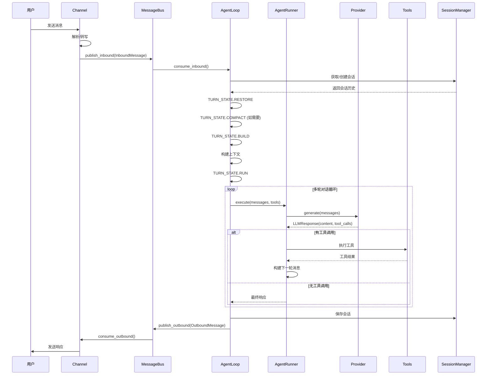
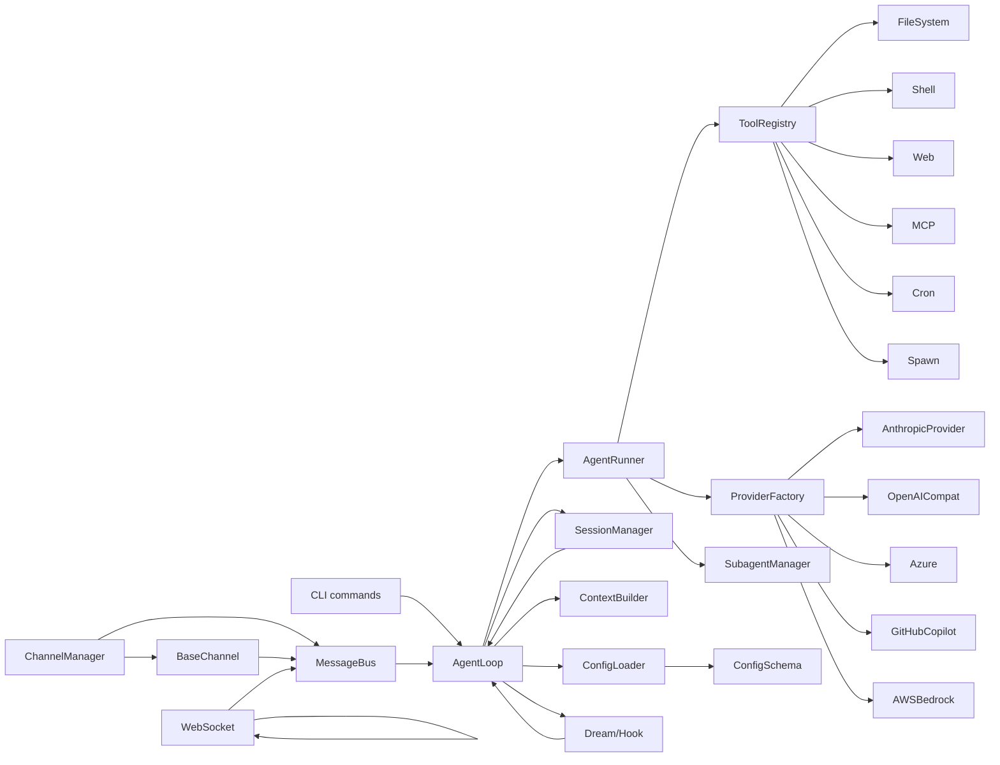

# nanobot 架构分析文档

## 项目概述

nanobot 是一个轻量级、开源的 AI 智能体框架，采用 Python 编写，配备 React/TypeScript WebUI。其核心设计围绕一个小型智能体循环展开，接收聊天通道消息、调用 LLM 提供商、执行工具、管理会话记忆。

### 关键特性

- **异步驱动**：完全基于 Python 3.11+ asyncio
- **消息总线解耦**：通道与智能体核心通过异步队列解耦
- **多平台支持**：内置 15+ 聊天平台集成（Telegram、Discord、Slack 等）
- **多提供商支持**：Anthropic、OpenAI、Azure、GitHub Copilot、AWS Bedrock 等
- **丰富的工具系统**：文件系统、Shell 执行、Web 搜索/获取、MCP 服务器、Notebook 编辑等
- **记忆系统**：基于 Dream 的两阶段记忆巩固
- **配置驱动**：通过 Pydantic 支持的 JSON 配置文件

---

## 核心架构设计

### 整体架构图

```mermaid
graph TB
    subgraph "外部平台"
        T[Telegram]
        D[Discord]
        S[Slack]
        F[Feishu]
        WX[WeChat]
        QQ[QQ]
        WS[WebSocket]
    end

    subgraph "通道层 (nanobot/channels/)"
        CM[ChannelManager]
        T1[TelegramChannel]
        D1[DiscordChannel]
        S1[SlackChannel]
        F1[FeishuChannel]
        WX1[WeChatChannel]
        QQ1[QQChannel]
        WS1[WebSocketChannel]
        B[BaseChannel]
    end

    subgraph "消息总线 (nanobot/bus/)"
        MB[MessageBus]
        IM[InboundMessage]
        OM[OutboundMessage]
    end

    subgraph "智能体核心 (nanobot/agent/)"
        AL[AgentLoop]
        AR[AgentRunner]
        CT[ContextBuilder]
        TR[ToolRegistry]
        SM[SubagentManager]
        DH[Dream/Hook]
    end

    subgraph "工具层 (nanobot/agent/tools/)"
        FS[FileSystem]
        SH[Shell]
        WB[Web]
        MC[MCP]
        CR[Cron]
        SP[Spawn]
        MY[MyTool]
    end

    subgraph "提供商层 (nanobot/providers/)"
        PR[ProviderFactory]
        AP[AnthropicProvider]
        OP[OpenAICompat]
        AZ[Azure]
        GH[GitHubCopilot]
        BW[AWSBedrock]
    end

    subgraph "会话与配置"
        SE[SessionManager]
        CF[ConfigLoader]
        CS[ConfigSchema]
    end

    subgraph "WebUI (webui/)"
        VA[Vite SPA]
        GW[Gateway]
        WS2[WebSocket]
    end

    T --> T1
    D --> D1
    S --> S1
    F --> F1
    WX --> WX1
    QQ --> QQ1
    WS --> WS1

    T1 --> B
    D1 --> B
    S1 --> B
    F1 --> B
    WX1 --> B
    QQ1 --> B
    WS1 --> B

    CM --> B
    CM --> MB

    T1 -->|InboundMessage| MB
    D1 -->|InboundMessage| MB
    S1 -->|InboundMessage| MB
    F1 -->|InboundMessage| MB
    WX1 -->|InboundMessage| MB
    QQ1 -->|InboundMessage| MB
    WS1 -->|InboundMessage| MB

    MB --> AL
    AL --> AR
    AL --> CT
    AR --> PR

    PR --> AP
    PR --> OP
    PR --> AZ
    PR --> GH
    PR --> BW

    AR --> TR
    TR --> FS
    TR --> SH
    TR --> WB
    TR --> MC
    TR --> CR
    TR --> SP
    TR --> MY

    AL --> SM
    AL --> DH
    AL --> SE

    CF --> CS
    AL --> CS

    MB -->|OutboundMessage| CM
    CM --> T1
    CM --> D1
    CM --> S1
    CM --> F1
    CM --> WX1
    CM --> QQ1
    CM --> WS1

    VA -->|WebSocket| WS2
    WS2 --> GW
    GW --> MB
    MB --> GW
    GW --> WS2
    WS2 --> VA

    SE <--> AL
```



---

## 核心数据流

### 消息处理时序图



---

## 模块详解

### 1. 消息总线 (nanobot/bus/)

**核心文件**：`queue.py`

**设计模式**：生产者-消费者模式

**关键特性**：
- 双队列设计（入站/出站）
- 异步解耦通道与智能体
- 背压机制防止消息堆积

```python
class MessageBus:
    inbound: asyncio.Queue[InboundMessage]  # 通道 → 智能体
    outbound: asyncio.Queue[OutboundMessage]  # 智能体 → 通道
```

### 2. 智能体循环 (nanobot/agent/)

#### AgentLoop (loop.py)

核心处理引擎，负责：
- 会话键管理
- Hook 协调
- 上下文构建
- 轮次状态机

**轮次状态**：
```python
class TurnState(Enum):
    RESTORE = auto()   # 恢复会话
    COMPACT = auto()   # 自动压缩
    COMMAND = auto()   # 命令处理
    BUILD = auto()     # 构建上下文
    RUN = auto()       # 执行 LLM 调用
    SAVE = auto()      # 保存会话
    RESPOND = auto()   # 发送响应
    DONE = auto()      # 完成
```

#### AgentRunner (runner.py)

实际执行 LLM 对话循环：
- 发送消息到提供商
- 接收工具调用
- 执行工具
- 流式响应处理

**关键配置**：
```python
@dataclass
class AgentRunSpec:
    initial_messages: list[dict[str, Any]]
    tools: ToolRegistry
    model: str
    max_iterations: int
    max_tool_result_chars: int
    temperature: float | None = None
    max_tokens: int | None = None
    reasoning_effort: str | None = None
    concurrent_tools: bool = False
    workspace: Path | None = None
```

### 3. 通道层 (nanobot/channels/)

**基类**：`BaseChannel` (base.py)

**设计模式**：策略模式 + 工厂模式

**核心接口**：
```python
class BaseChannel(ABC):
    name: str                    # 通道标识符
    display_name: str            # 显示名称
    send_progress: bool          # 发送进度
    show_reasoning: bool         # 显示推理过程

    async def login(self) -> bool: ...
    async def start(self) -> None: ...
    async def stop(self) -> None: ...
    async def send(self, msg: OutboundMessage) -> None: ...
    async def send_delta(self, delta: str) -> None: ...
```

**内置通道**：
- Telegram、Discord、Slack、Feishu、Matrix
- WhatsApp、WeChat、QQ
- WebSocket、Email
- DingTalk、MSTeams、MoChat、WeCom

**发现机制**：
- `pkgutil` 扫描 + entry-point 插件
- 动态加载配置

### 4. 提供商层 (nanobot/providers/)

**基类**：`LLMProvider` (base.py)

**设计模式**：工厂模式 + 注册表模式

**核心数据结构**：
```python
@dataclass
class ToolCallRequest:
    id: str
    name: str
    arguments: dict[str, Any]

@dataclass
class LLMResponse:
    content: str | None
    tool_calls: list[ToolCallRequest]
    finish_reason: str
    usage: dict[str, int]
    reasoning_content: str | None      # Kimi/DeepSeek
    thinking_blocks: list[dict] | None  # Anthropic
```

**内置提供商**：
- Anthropic (Claude)
- OpenAI 兼容（Azure、DeepSeek、Moonshot 等）
- GitHub Copilot
- AWS Bedrock

### 5. 工具系统 (nanobot/agent/tools/)

**注册中心**：`ToolRegistry` (registry.py)

**设计模式**：注册表模式 + 命令模式

**内置工具**：
| 工具 | 功能 |
|------|------|
| read_file/write_file/edit | 文件系统操作 |
| exec | Shell 命令执行 |
| web_search/web_fetch | Web 搜索和获取 |
| mcp_* | MCP 服务器工具 |
| cron | 定时任务 |
| spawn | 子智能体生成 |
| MyTool | 自我修改 |

**工具排序策略**：
- 内置工具优先（稳定顺序）
- MCP 工具后置（字母序）

### 6. 会话管理 (nanobot/session/)

**核心类**：`Session` (manager.py)

**特性**：
- 原子写入 + fsync（持久化）
- TTL 自动压缩
- 预览生成

```python
@dataclass
class Session:
    key: str                          # channel:chat_id
    messages: list[dict[str, Any]]
    created_at: datetime
    updated_at: datetime
    metadata: dict[str, Any]
    last_consolidated: int            # 已巩固消息数
```

### 7. 配置系统 (nanobot/config/)

**Schema**：Pydantic 模型 (schema.py)

**特性**：
- camelCase/snek_case 双模式支持
- 环境变量覆盖
- 类型验证

```python
class Base(BaseModel):
    model_config = ConfigDict(
        alias_generator=to_camel,
        populate_by_name=True
    )
```

### 8. 记忆系统 (nanobot/agent/memory.py)

**Dream** 两阶段巩固：
1. **Phase 1**: 提取重复模式（去重）
2. **Phase 2**: 生成摘要文档（知识蒸馏）

**配置**：
```python
class DreamConfig(Base):
    interval_h: int = 2               # 每 2 小时
    max_batch_size: int = 20          # 每批 20 条
    max_iterations: int = 15          # 最多 15 次工具调用
```

---

## 模块依赖关系图



---

## 关键设计模式

| 模式 | 应用位置 | 说明 |
|------|----------|------|
| 生产者-消费者 | MessageBus | 解耦通道与智能体 |
| 策略模式 | Channels | 不同平台适配 |
| 工厂模式 | ProviderFactory | 提供商实例化 |
| 注册表模式 | ToolRegistry | 工具管理 |
| 状态机 | TurnState | 轮次流程控制 |
| 模板方法 | BaseChannel | 通道生命周期 |
| 观察者 | Hook 系统 | 事件扩展 |
| 中介者 | ChannelManager | 通道协调 |

---

## 技术栈清单

### 核心依赖

| 类别 | 库 | 版本要求 | 用途 |
|------|-----|---------|------|
| CLI | typer | ^0.20.0 | 命令行界面 |
| LLM | anthropic | ^0.45.0 | Anthropic Claude |
| LLM | openai | ^2.8.0 | OpenAI 兼容 |
| 配置 | pydantic | ^2.12.0 | 配置验证 |
| 异步 | websockets | ^16.0 | WebSocket 通信 |
| HTTP | httpx | ^0.28.0 | 异步 HTTP 客户端 |
| 搜索 | ddgs | ^9.5.5 | DuckDuckGo 搜索 |
| 日志 | loguru | ^0.7.3 | 日志记录 |
| 解析 | readability-lxml | ^0.8.4 | 网页内容提取 |
| 显示 | rich | ^14.0.0 | 终端美化 |
| 定时 | croniter | ^6.0.0 | Cron 解析 |
| 工具 | prompt-toolkit | ^3.0.50 | 交互式输入 |
| 工具 | questionary | ^2.0.0 | 用户交互 |
| MCP | mcp | ^1.26.0 | MCP 协议 |
| 文档 | jinja2 | ^3.1.0 | 模板渲染 |
| 文档 | pypdf | ^5.0.0 | PDF 解析 |
| 文档 | python-docx | ^1.1.0 | Word 解析 |
| 文档 | openpyxl | ^3.1.0 | Excel 解析 |
| 文档 | python-pptx | ^1.0.0 | PowerPoint 解析 |
| 加密 | pycryptodome | ^3.20.0 | 加密支持 |
| 云服务 | boto3 | ^1.43.0 | AWS 集成 |

### 通道依赖

| 通道 | 依赖 | 用途 |
|------|-----|------|
| Telegram | python-telegram-bot | Telegram Bot API |
| Slack | slack-sdk | Slack Web API |
| Discord | discord.py | Discord Bot API |
| Matrix | matrix-nio | Matrix 协议 |
| WhatsApp | lark-oapi | 飞桥 WebSocket |
| 飞桥 | lark-oapi | 飞桥 WebSocket |
| DingTalk | dingtalk-stream | 钉钉流式 API |
| QQ | qq-botpy | QQ 机器人 |
| Web | aiohttp | Web API 服务器 |

### 开发依赖

| 库 | 用途 |
|-----|------|
| pytest | 测试框架 |
| pytest-asyncio | 异步测试 |
| pytest-cov | 覆盖率报告 |
| ruff | 代码检查和格式化 |
| pymupdf | PDF 处理（dev） |

---

## 架构约束

来自 `.agent/design.md`：

1. **无状态优先**：核心循环设计为无状态，状态存储在会话管理器中
2. **可扩展性**：通过插件机制支持新通道、新提供商、新工具
3. **容错性**：工具执行失败不影响整体流程
4. **背压控制**：消息队列防止内存溢出
5. **原子操作**：会话保存使用 fsync 确保持久化

---

## 安全边界

来自 `.agent/security.md`：

1. **工具执行沙箱**：Shell 工具限制工作目录
2. **文件访问控制**：工具工具限制访问范围
3. **输入验证**：所有外部输入经过 Pydantic 验证
4. **API 密钥保护**：不记录日志，环境变量存储
5. **MCP 隔离**：MCP 工具独立命名空间

---

## WebUI 架构

### 前端 (webui/)

- **框架**：Vite + React + TypeScript
- **通信**：WebSocket 复用协议
- **代理**：开发服务器代理 `/api`、`/webui`、`/auth`

### 网关

- **WebSocket 处理**：复用协议实现多路复用
- **API 代理**：统一 API 入口

---

## 测试体系

- **框架**：pytest + pytest-asyncio
- **模式**：asyncio_mode = "auto"
- **结构**：镜像 `nanobot/` 包结构

---

## 常见陷阱

来自 `.agent/gotchas.md`：

1. **异步上下文**：必须正确使用 async/await
2. **消息顺序**：依赖时间戳排序
3. **工具并发**：部分工具不安全并发
4. **上下文窗口**：注意 token 限制
5. **会话压缩**：压缩可能导致信息丢失