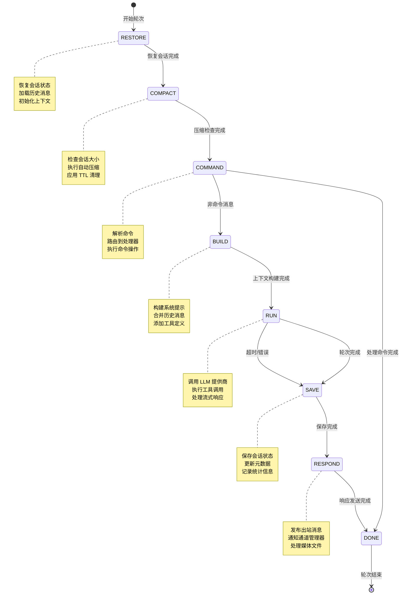

# Agent 循环状态机图

```mermaid
stateDiagram-v2
    [*] --> RESTORE: 开始轮次
    RESTORE --> COMPACT: 恢复会话完成
    COMPACT --> COMMAND: 压缩检查完成

    COMMAND --> BUILD: 非命令消息
    COMMAND --> DONE: 处理命令完成

    BUILD --> RUN: 上下文构建完成

    RUN --> SAVE: 轮次完成
    RUN --> SAVE: 超时/错误

    SAVE --> RESPOND: 保存完成

    RESPOND --> DONE: 响应发送完成

    DONE --> [*]: 轮次结束

    note right of RESTORE
        恢复会话状态
        加载历史消息
        初始化上下文
    end note

    note right of COMPACT
        检查会话大小
        执行自动压缩
        应用 TTL 清理
    end note

    note right of COMMAND
        解析命令
        路由到处理器
        执行命令操作
    end note

    note right of BUILD
        构建系统提示
        合并历史消息
        添加工具定义
    end note

    note right of RUN
        调用 LLM 提供商
        执行工具调用
        处理流式响应
    end note

    note right of SAVE
        保存会话状态
        更新元数据
        记录统计信息
    end note

    note right of RESPOND
        发布出站消息
        通知通道管理器
        处理媒体文件
    end note
```