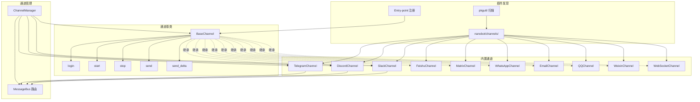
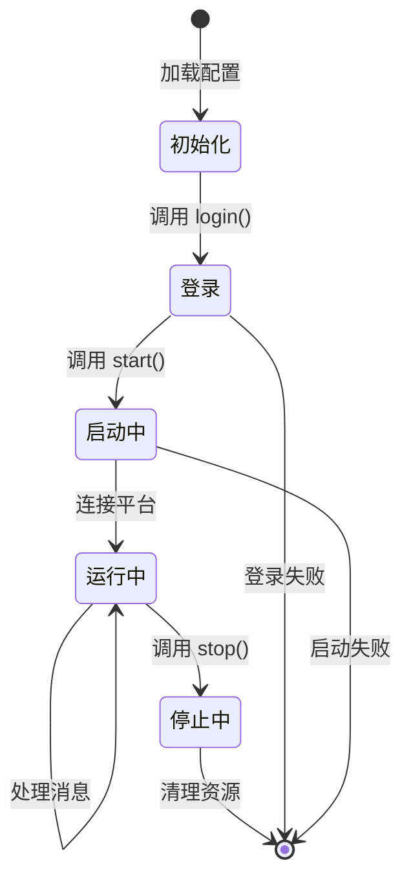

# 通道插件架构图

```mermaid
graph TB
    subgraph "插件发现"
        PS[pkgutil 扫描]
        EP[Entry-point 注册]
        DC[nanobot/channels/]
    end

    subgraph "通道基类"
        BC[BaseChannel]
        BI[login]
        BS[start]
        BST[stop]
        BSE[send]
        BSD[send_delta]
    end

    subgraph "内置通道"
        TC[TelegramChannel]
        DCc[DiscordChannel]
        SC[SlackChannel]
        FC[FeishuChannel]
        MxC[MatrixChannel]
        WC[WhatsAppChannel]
        EC[EmailChannel]
        QCC[QQChannel]
        WXC[WeixinChannel]
        WSC[WebSocketChannel]
    end

    subgraph "通道管理"
        CM[ChannelManager]
        MR[MessageBus 路由]
    end

    PS --> DC
    EP --> BC

    DC --> TC
    DC --> DCc
    DC --> SC
    DC --> FC
    DC --> MxC
    DC --> WC
    DC --> EC
    DC --> QCC
    DC --> WXC
    DC --> WSC

    BC -.继承.-> TC
    BC -.继承.-> DCc
    BC -.继承.-> SC
    BC -.继承.-> FC
    BC -.继承.-> MxC
    BC -.继承.-> WC
    BC -.继承.-> EC
    BC -.继承.-> QCC
    BC -.继承.-> WXC
    BC -.继承.-> WSC

    BC --> BI
    BC --> BS
    BC --> BST
    BC --> BSE
    BC --> BSD

    CM --> BC
    CM --> TC
    CM --> DCc
    CM --> SC
    CM --> MR

    TC --> MR
    DCc --> MR
    SC --> MR
```

## 通道生命周期

```mermaid
stateDiagram-v2
    [*] --> 初始化: 加载配置
    初始化 --> 登录: 调用 login()
    登录 --> 启动中: 调用 start()
    启动中 --> 运行中: 连接平台
    运行中 --> 运行中: 处理消息
    运行中 --> 停止中: 调用 stop()
    停止中 --> [*]: 清理资源

    登录 --> [*]: 登录失败
    启动中 --> [*]: 启动失败
```