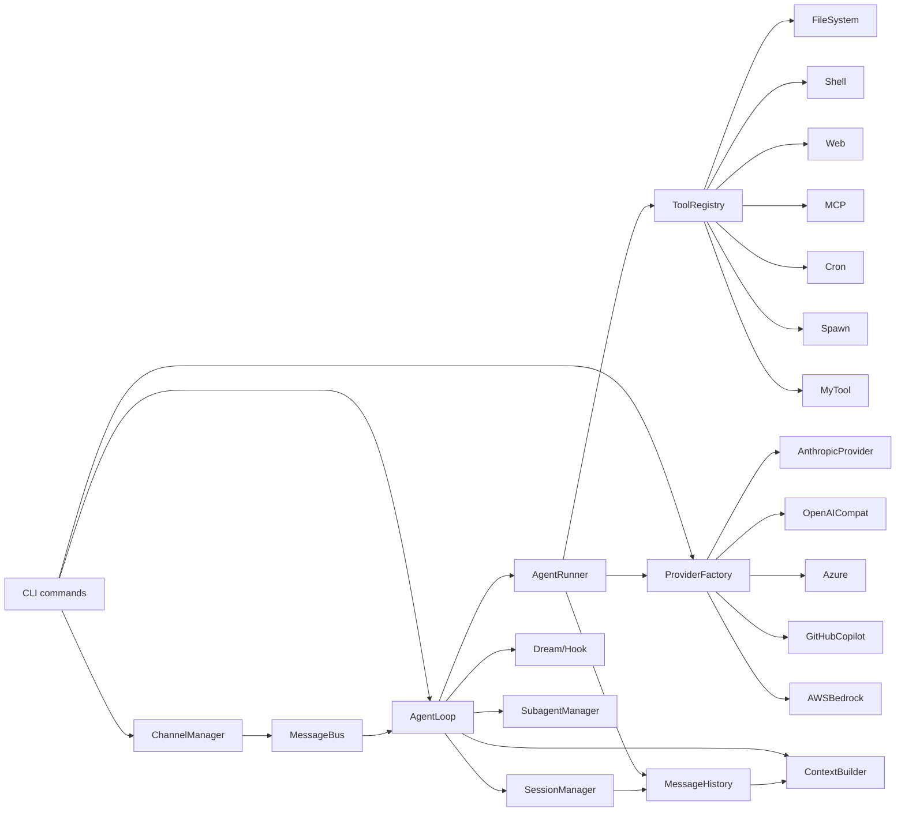

# 核心模块依赖关系图

```mermaid
graph LR
    CL[CLI commands] --> AL[AgentLoop]
    CL --> CM[ChannelManager]
    CL --> PR[ProviderFactory]

    AL --> AR[AgentRunner]
    AL --> SE[SessionManager]
    AL --> CT[ContextBuilder]
    AL --> DH[Dream/Hook]
    AL --> SM[SubagentManager]

    AR --> TR[ToolRegistry]
    AR --> PR
    AR --> MH[MessageHistory]

    PR --> AP[AnthropicProvider]
    PR --> OP[OpenAICompat]
    PR --> AZ[Azure]
    PR --> GH[GitHubCopilot]
    PR --> BW[AWSBedrock]

    TR --> FS[FileSystem]
    TR --> SH[Shell]
    TR --> WB[Web]
    TR --> MC[MCP]
    TR --> CR[Cron]
    TR --> SP[Spawn]
    TR --> MY[MyTool]

    CM --> MB[MessageBus]
    MB --> AL

    SE --> MH
    MH --> CT
```