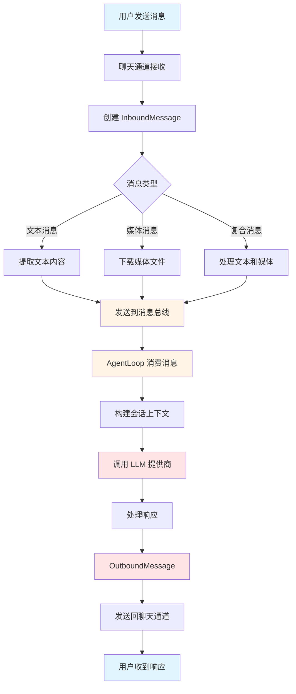

# 消息接收到响应完整流程

```mermaid
flowchart TD
    A[用户发送消息] --> B[聊天通道接收]
    B --> C[创建 InboundMessage]
    C --> D{消息类型}
    
    D -->|文本消息| E[提取文本内容]
    D -->|媒体消息| F[下载媒体文件]
    D -->|复合消息| G[处理文本和媒体]
    
    E --> H[发送到消息总线]
    F --> H
    G --> H
    
    H --> I[AgentLoop 消费消息]
    I --> J[构建会话上下文]
    J --> K[调用 LLM 提供商]
    K --> L[处理响应]
    L --> M[OutboundMessage]
    M --> N[发送回聊天通道]
    N --> O[用户收到响应]
    
    style A fill:#e1f5ff
    style O fill:#e1f5ff
    style H fill:#fff4e6
    style I fill:#fff4e6
    style K fill:#ffe4e6
    style M fill:#ffe4e6
```