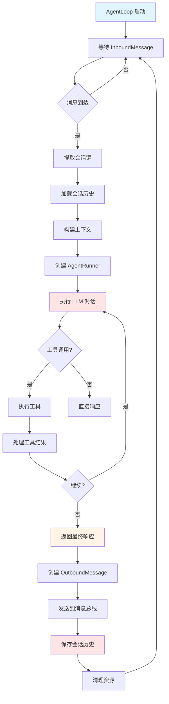

# Agent 循环执行流程

```mermaid
flowchart TD
    A[AgentLoop 启动] --> B[等待 InboundMessage]
    B --> C{消息到达}
    
    C -->|否| B
    C -->|是| D[提取会话键]
    D --> E[加载会话历史]
    E --> F[构建上下文]
    
    F --> G[创建 AgentRunner]
    G --> H[执行 LLM 对话]
    
    H --> I{工具调用?}
    I -->|是| J[执行工具]
    I -->|否| K[直接响应]
    
    J --> L[处理工具结果]
    L --> M{继续?}
    M -->|是| H
    M -->|否| N[返回最终响应]
    
    N --> O[创建 OutboundMessage]
    O --> P[发送到消息总线]
    P --> Q[保存会话历史]
    Q --> R[清理资源]
    R --> B
    
    style A fill:#e1f5ff
    style H fill:#ffe4e6
    style N fill:#fff4e6
    style Q fill:#ffe4e6
```