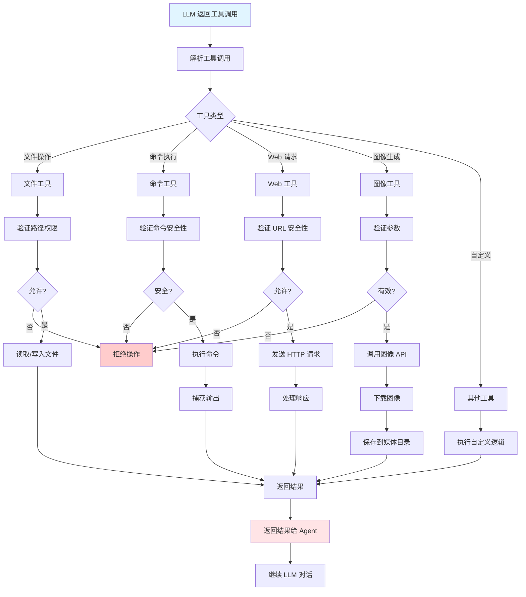

# 工具调用与执行流程

```mermaid
flowchart TD
    A[LLM 返回工具调用] --> B[解析工具调用]
    B --> C{工具类型}
    
    C -->|文件操作| D[文件工具]
    C -->|命令执行| E[命令工具]
    C -->|Web 请求| F[Web 工具]
    C -->|图像生成| G[图像工具]
    C -->|自定义| H[其他工具]
    
    D --> I[验证路径权限]
    I --> J{允许?}
    J -->|否| K[拒绝操作]
    J -->|是| L[读取/写入文件]
    L --> M[返回结果]
    
    E --> N[验证命令安全性]
    N --> O{安全?}
    O -->|否| K
    O -->|是| P[执行命令]
    P --> Q[捕获输出]
    Q --> M
    
    F --> R[验证 URL 安全性]
    R --> S{允许?}
    S -->|否| K
    S -->|是| T[发送 HTTP 请求]
    T --> U[处理响应]
    U --> M
    
    G --> V[验证参数]
    V --> W{有效?}
    W -->|否| K
    W -->|是| X[调用图像 API]
    X --> Y[下载图像]
    Y --> Z[保存到媒体目录]
    Z --> M
    
    H --> AA[执行自定义逻辑]
    AA --> M
    
    M --> AB[返回结果给 Agent]
    AB --> AC[继续 LLM 对话]
    
    style A fill:#e1f5ff
    style AB fill:#ffe4e6
    style K fill:#ffcccc
```