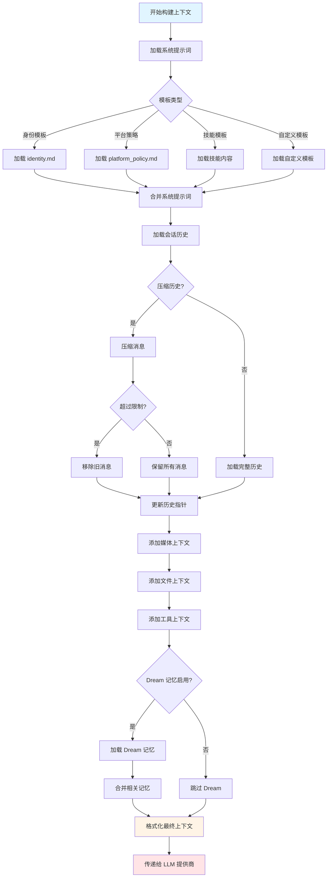

# 会话上下文构建流程

```mermaid
flowchart TD
    A[开始构建上下文] --> B[加载系统提示词]
    B --> C{模板类型}
    
    C -->|身份模板| D[加载 identity.md]
    C -->|平台策略| E[加载 platform_policy.md]
    C -->|技能模板| F[加载技能内容]
    C -->|自定义模板| G[加载自定义模板]
    
    D --> H[合并系统提示词]
    E --> H
    F --> H
    G --> H
    
    H --> I[加载会话历史]
    I --> J{压缩历史?}
    
    J -->|是| K[压缩消息]
    J -->|否| L[加载完整历史]
    
    K --> M{超过限制?}
    M -->|是| N[移除旧消息]
    M -->|否| O[保留所有消息]
    
    N --> P[更新历史指针]
    L --> P
    O --> P
    
    P --> Q[添加媒体上下文]
    Q --> R[添加文件上下文]
    R --> S[添加工具上下文]
    
    S --> T{Dream 记忆启用?}
    T -->|是| U[加载 Dream 记忆]
    T -->|否| V[跳过 Dream]
    
    U --> W[合并相关记忆]
    V --> X[格式化最终上下文]
    W --> X
    
    X --> Y[传递给 LLM 提供商]
    
    style A fill:#e1f5ff
    style Y fill:#ffe4e6
    style X fill:#fff4e6
```