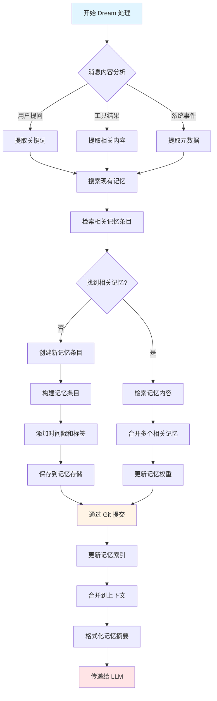

# 内存合并 (Dream) 流程

```mermaid
flowchart TD
    A[开始 Dream 处理] --> B{消息内容分析}
    
    B -->|用户提问| C[提取关键词]
    B -->|工具结果| D[提取相关内容]
    B -->|系统事件| E[提取元数据]
    
    C --> F[搜索现有记忆]
    D --> F
    E --> F
    
    F --> G[检索相关记忆条目]
    G --> H{找到相关记忆?}
    
    H -->|否| I[创建新记忆条目]
    H -->|是| J[检索记忆内容]
    
    I --> K[构建记忆条目]
    K --> L[添加时间戳和标签]
    L --> M[保存到记忆存储]
    
    J --> N[合并多个相关记忆]
    N --> O[更新记忆权重]
    
    M --> P[通过 Git 提交]
    O --> P
    
    P --> Q[更新记忆索引]
    Q --> R[合并到上下文]
    
    R --> S[格式化记忆摘要]
    S --> T[传递给 LLM]
    
    style A fill:#e1f5ff
    style T fill:#ffe4e6
    style P fill:#fff4e6
```