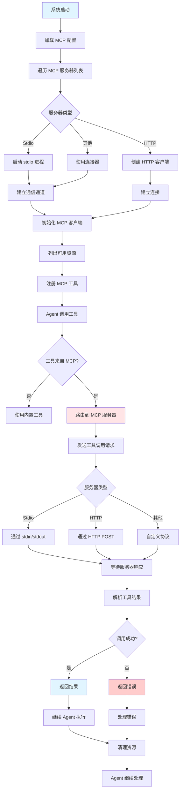

# MCP 连接与调用流程

```mermaid
flowchart TD
    A[系统启动] --> B[加载 MCP 配置]
    B --> C[遍历 MCP 服务器列表]
    
    C --> D{服务器类型}
    D -->|Stdio| E[启动 stdio 进程]
    D -->|HTTP| F[创建 HTTP 客户端]
    D -->|其他| G[使用连接器]
    
    E --> H[建立通信通道]
    F --> I[建立连接]
    G --> H
    
    H --> J[初始化 MCP 客户端]
    I --> J
    J --> K[列出可用资源]
    K --> L[注册 MCP 工具]
    
    L --> M[Agent 调用工具]
    M --> N{工具来自 MCP?}
    
    N -->|否| O[使用内置工具]
    N -->|是| P[路由到 MCP 服务器]
    
    P --> Q[发送工具调用请求]
    Q --> R{服务器类型}
    
    R -->|Stdio| S[通过 stdin/stdout]
    R -->|HTTP| T[通过 HTTP POST]
    R -->|其他| U[自定义协议]
    
    S --> V[等待服务器响应]
    T --> V
    U --> V
    
    V --> W[解析工具结果]
    W --> X{调用成功?}
    
    X -->|是| Y[返回结果]
    X -->|否| Z[返回错误]
    
    Y --> AA[继续 Agent 执行]
    Z --> AB[处理错误]
    
    AA --> AC[清理资源]
    AB --> AC
    AC --> AD[Agent 继续处理]
    
    style A fill:#e1f5ff
    style P fill:#ffe4e6
    style Y fill:#e1f5ff
    style Z fill:#ffcccc
```