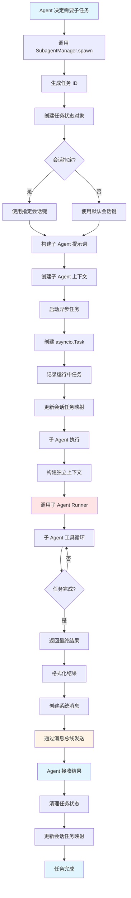

# 子 Agent 启动流程

```mermaid
flowchart TD
    A[Agent 决定需要子任务] --> B[调用 SubagentManager.spawn]
    B --> C[生成任务 ID]
    C --> D[创建任务状态对象]
    
    D --> E{会话指定?}
    E -->|是| F[使用指定会话键]
    E -->|否| G[使用默认会话键]
    
    F --> H[构建子 Agent 提示词]
    G --> H
    
    H --> I[创建子 Agent 上下文]
    I --> J[启动异步任务]
    
    J --> K[创建 asyncio.Task]
    K --> L[记录运行中任务]
    L --> M[更新会话任务映射]
    
    M --> N[子 Agent 执行]
    N --> O[构建独立上下文]
    O --> P[调用子 Agent Runner]
    
    P --> Q[子 Agent 工具循环]
    Q --> R{任务完成?}
    
    R -->|是| S[返回最终结果]
    R -->|否| Q
    
    S --> T[格式化结果]
    T --> U[创建系统消息]
    U --> V[通过消息总线发送]
    
    V --> W[Agent 接收结果]
    W --> X[清理任务状态]
    
    X --> Y[更新会话任务映射]
    Y --> Z[任务完成]
    
    style A fill:#e1f5ff
    style Z fill:#e1f5ff
    style P fill:#ffe4e6
    style V fill:#fff4e6
    style W fill:#e1f5ff
```