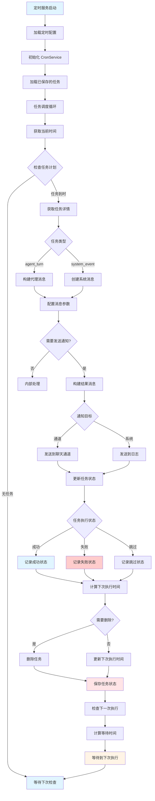

# 定时任务调度流程

```mermaid
flowchart TD
    A[定时服务启动] --> B[加载定时配置]
    B --> C[初始化 CronService]
    C --> D[加载已保存的任务]
    
    D --> E[任务调度循环]
    E --> F[获取当前时间]
    
    F --> G{检查任务计划}
    G -->|任务到时| H[获取任务详情]
    G -->|无任务| I[等待下次检查]
    
    H --> J{任务类型}
    J -->|agent_turn| K[构建代理消息]
    J -->|system_event| L[创建系统消息]
    
    K --> M[配置消息参数]
    L --> M
    
    M --> N{需要发送通知?}
    N -->|是| O[构建结果消息]
    N -->|否| P[内部处理]
    
    O --> Q{通知目标}
    Q -->|通道| R[发送到聊天通道]
    Q -->|系统| S[发送到日志]
    
    R --> T[更新任务状态]
    S --> T
    
    T --> U{任务执行状态}
    U -->|成功| V[记录成功状态]
    U -->|失败| W[记录失败状态]
    U -->|跳过| X[记录跳过状态]
    
    V --> Y[计算下次执行时间]
    W --> Y
    X --> Y
    
    Y --> Z{需要删除?}
    Z -->|是| AA[删除任务]
    Z -->|否| AB[更新下次执行时间]
    
    AA --> AC[保存任务状态]
    AB --> AC
    
    AC --> AD[检查下一次执行]
    AD --> AE[计算等待时间]
    AE --> AF[等待到下次执行]
    
    AF --> I
    
    style A fill:#e1f5ff
    style AF fill:#fff4e6
    style I fill:#e1f5ff
    style AC fill:#ffe4e6
    style V fill:#e1f5ff
    style W fill:#ffcccc
```