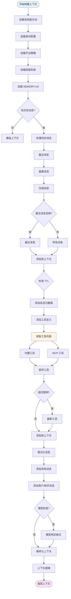

# 会话上下文构建流程

```mermaid
flowchart TD
    Start([开始构建上下文]) --> LoadSystem[加载系统提示词]
    LoadSystem --> Identity[加载身份配置]
    Identity --> PlatformPolicy[加载平台策略]

    PlatformPolicy --> LoadSkills[加载技能系统]
    LoadSkills --> LoadMemory[加载 MEMORY.md]

    LoadMemory --> CheckHistory{有历史消息?}
    CheckHistory -->|否| BaseContext[基础上下文]
    CheckHistory -->|是| ProcessHistory

    ProcessHistory[处理历史消息] --> Recent[最近消息]
    Recent --> Important[重要消息]
    Important --> Compact[压缩消息]

    Compact --> CheckRecent{最近消息足够?}
    CheckRecent -->|是| RecentMessages[最近消息]
    CheckRecent -->|否| AllMessages[所有消息]

    RecentMessages --> AddHistory[添加到上下文]
    AllMessages --> AddHistory

    AddHistory --> CheckTTL{检查 TTL}
    CheckTTL --> AddSessionMeta[添加会话元数据]

    AddSessionMeta --> AddTools[添加工具定义]
    AddTools --> ToolRegistry[获取工具列表]
    ToolRegistry --> Builtins[内置工具]
    ToolRegistry --> MCPTools[MCP 工具]

    Builtins --> SortTools[排序工具]
    MCPTools --> SortTools

    SortTools --> CheckLimit{超过限制?}
    CheckLimit -->|是| TruncateTools[截断工具]
    CheckLimit -->|否| AddToContext

    TruncateTools --> AddToContext[添加到上下文]
    AddToContext --> FormatMessages[格式化消息]

    FormatMessages --> AddSystem[添加系统消息]
    AddSystem --> AddMessages[添加用户/助手消息]

    AddMessages --> CheckModel{模型检查?}
    CheckModel -->|是| ModelSpecific[模型特定格式]
    CheckModel -->|否| Finalize

    ModelSpecific --> Finalize[最终化上下文]
    Finalize --> ContextReady[上下文就绪]

    ContextReady --> End([返回上下文])

    style Start fill:#e1f5ff
    style End fill:#ffe1f5
    style ToolRegistry fill:#fff4e1
```