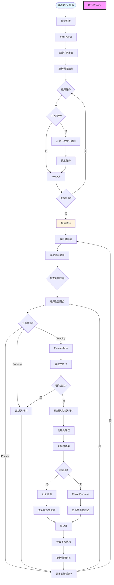

# 定时任务调度流程

```mermaid
flowchart TD
    Start([启动 Cron 服务]) --> LoadConfig[加载配置]
    LoadConfig --> InitializeStore[初始化存储]

    InitializeStore --> LoadJobs[加载任务定义]
    LoadJobs --> ParseSchedule[解析调度规则]

    ParseSchedule --> ForEachJob{遍历任务}
    ForEachJob --> CheckEnabled{任务启用?}
    CheckEnabled -->|否| NextJob
    CheckEnabled -->|是| CalculateNext[计算下次执行时间]

    CalculateNext --> ScheduleJob[调度任务]
    ScheduleJob --> NextJob

    NextJob --> CheckMore{更多任务?}
    CheckMore -->|是| ForEachJob
    CheckMore -->|否| StartLoop[启动循环]

    StartLoop --> WaitTick[等待时间刻]
    WaitTick --> CurrentTime[获取当前时间]

    CurrentTime --> CheckJobs{检查到期任务}
    CheckJobs --> ForEachDueJob[遍历到期任务]

    ForEachDueJob --> CheckState{任务状态?}
    CheckState -->|Running| SkipRunning[跳过运行中]
    CheckState -->|Pending| ExecuteTask

    CheckState -->|Paused| CheckMoreDue
    SkipRunning --> CheckMoreDue

    ExecuteTask --> AcquireLock[获取文件锁]
    AcquireLock --> LockOK{获取成功?}
    LockOK -->|否| SkipRunning
    LockOK -->|是| UpdateState[更新状态为运行中]

    UpdateState --> CallHandler[调用处理器]
    CallHandler --> HandlerResult[处理器结果]

    HandlerResult --> CheckError{有错误?}
    CheckError -->|是| RecordError[记录错误]
    CheckError -->|否| RecordSuccess

    RecordError --> UpdateFailed[更新状态为失败]
    RecordSuccess --> UpdateSuccess[更新状态为成功]

    UpdateFailed --> ReleaseLock[释放锁]
    UpdateSuccess --> ReleaseLock

    ReleaseLock --> CalculateNextExecution[计算下次执行]
    CalculateNextExecution --> UpdateSchedule[更新调度时间]

    UpdateSchedule --> CheckMoreDue[更多到期任务?]
    CheckMoreDue -->|是| ForEachDueJob
    CheckMoreDue -->|否| WaitTick

    style Start fill:#e1f5ff
    style StartLoop fill:#fff4e1
    style CronService fill:#f9f,stroke:#333,stroke-width:4px
```