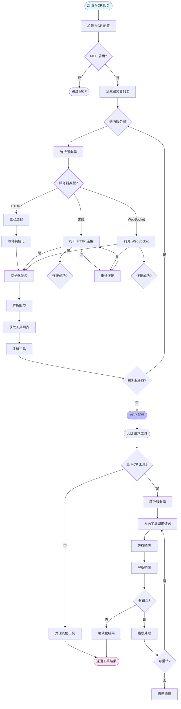

# MCP 连接与调用流程

```mermaid
flowchart TD
    Start([启动 MCP 服务]) --> LoadConfig[加载 MCP 配置]
    LoadConfig --> CheckEnabled{MCP 启用?}
    CheckEnabled -->|否| Skip([跳过 MCP])
    CheckEnabled -->|是| GetServers[获取服务器列表]

    GetServers --> ForEachServers{遍历服务器}

    ForEachServers --> ConnectServer[连接服务器]
    ConnectServer --> ServerType{服务器类型?}

    ServerType -->|STDIO| StartProcess[启动进程]
    ServerType -->|SSE| OpenHTTP[打开 HTTP 连接]
    ServerType -->|WebSocket| OpenWS[打开 WebSocket]

    StartProcess --> WaitForInit[等待初始化]
    WaitForInit --> InitResponse[初始化响应]

    OpenHTTP --> CheckHTTP{连接成功?}
    OpenHTTP -->|是| InitResponse
    OpenHTTP -->|否| RetryConnect[重试连接]
    RetryConnect --> OpenHTTP

    OpenWS --> CheckWS{连接成功?}
    OpenWS -->|是| InitResponse
    OpenWS -->|否| RetryConnect

    InitResponse --> ParseCapabilities[解析能力]
    ParseCapabilities --> GetTools[获取工具列表]
    GetTools --> RegisterTools[注册工具]

    RegisterTools --> CheckMore{更多服务器?}
    CheckMore -->|是| ForEachServers
    CheckMore -->|否| Ready([MCP 就绪])

    Ready --> ToolRequest([LLM 请求工具])
    ToolRequest --> CheckMCP{是 MCP 工具?}
    CheckMCP -->|否| HandleOther[处理其他工具]
    HandleOther --> End

    CheckMCP -->|是| GetServer[获取服务器]
    GetServer --> SendRequest[发送工具调用请求]
    SendRequest --> WaitForResponse[等待响应]

    WaitForResponse --> ParseResponse[解析响应]
    ParseResponse --> CheckError{有错误?}
    CheckError -->|是| ErrorHandle[错误处理]
    CheckError -->|否| FormatResult[格式化结果]

    ErrorHandle --> RetryTool{可重试?}
    RetryTool -->|是| SendRequest
    RetryTool -->|否| ReturnError[返回错误]

    FormatResult --> End([返回工具结果])

    style Start fill:#e1f5ff
    style End fill:#ffe1f5
    style Ready fill:#bbf
```