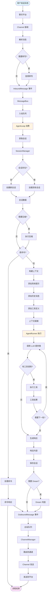

# 消息接收到响应完整流程

```mermaid
flowchart TD
    Start([用户发送消息]) --> Platform[聊天平台]
    Platform --> Channel[Channel 接收]
    Channel --> Parse[解析消息]
    Parse --> Transcribe{需要转写?}
    Transcribe -->|是| TranscribeService[音频转写]
    Transcribe -->|否| InboundEvent[InboundMessage 事件]
    TranscribeService --> InboundEvent

    InboundEvent --> Bus[MessageBus]
    Bus --> Queue[入站队列]
    Queue --> AgentLoop[AgentLoop 消费]

    AgentLoop --> GetSession[获取会话]
    GetSession --> SessionManager[SessionManager]
    SessionManager --> CheckExists{会话存在?}
    CheckExists -->|否| CreateSession[创建新会话]
    CheckExists -->|是| LoadSession[加载现有会话]
    CreateSession --> SessionData[会话数据]
    LoadSession --> SessionData

    SessionData --> AutoCompact{需要压缩?}
    AutoCompact -->|是| Compact[执行压缩]
    AutoCompact -->|否| CommandCheck
    Compact --> CommandCheck

    CommandCheck{是命令?}
    CommandCheck -->|是| ProcessCommand[处理命令]
    CommandCheck -->|否| BuildContext
    ProcessCommand --> CommandResponse[命令响应]
    CommandResponse --> OutboundEvent[OutboundMessage 事件]
    CommandResponse --> End

    BuildContext[构建上下文] --> AddSystem[添加系统提示]
    AddSystem --> AddHistory[添加历史消息]
    AddHistory --> AddTools[添加工具定义]
    AddTools --> ContextReady[上下文就绪]

    ContextReady --> AgentRunner[AgentRunner 执行]

    AgentRunner --> LLMCall[调用 LLM 提供商]
    LLMCall --> HasTools{有工具调用?}
    HasTools -->|否| GenerateResponse[生成响应]
    HasTools -->|是| ExecuteTools

    ExecuteTools[执行工具] --> ToolResult[工具结果]
    ToolResult --> NextIteration{需要下一轮?}
    NextIteration -->|是| LLMCall
    NextIteration -->|否| GenerateResponse

    GenerateResponse --> ResponseContent[响应内容]
    ResponseContent --> SaveSession[保存会话]

    SaveSession --> DreamCheck{需要 Dream?}
    DreamCheck -->|是| Dream[Dream 巩固]
    DreamCheck -->|否| OutboundEvent
    Dream --> OutboundEvent

    OutboundEvent --> OutQueue[出站队列]
    OutQueue --> ChannelManager[ChannelManager]
    ChannelManager --> RouteChannel[路由到通道]
    RouteChannel --> ChannelSend[Channel 发送]
    ChannelSend --> PlatformSend[发送到平台]
    PlatformSend --> End([流程结束])

    style Start fill:#e1f5ff
    style End fill:#ffe1f5
    style AgentLoop fill:#fff4e1
    style AgentRunner fill:#fff4e1
```