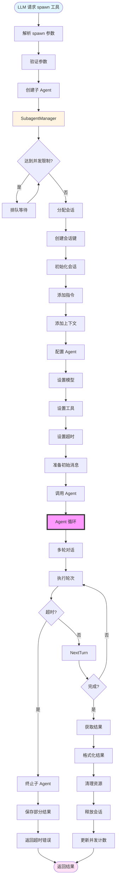

# 子 Agent 启动流程

```mermaid
flowchart TD
    Start([LLM 请求 spawn 工具]) --> ParseSpawnArgs[解析 spawn 参数]
    ParseSpawnArgs --> ValidateParams[验证参数]
    ValidateParams --> CreateSubagent[创建子 Agent]

    CreateSubagent --> SubagentManager[SubagentManager]
    SubagentManager --> CheckLimit{达到并发限制?}
    CheckLimit -->|是| QueueSpawn[排队等待]
    CheckLimit -->|否| AllocateSession[分配会话]

    QueueSpawn --> CheckLimit

    AllocateSession --> CreateSessionKey[创建会话键]
    CreateSessionKey --> InitializeSession[初始化会话]
    InitializeSession --> AddInstructions[添加指令]
    AddInstructions --> AddContext[添加上下文]

    AddContext --> ConfigureAgent[配置 Agent]
    ConfigureAgent --> SetModel[设置模型]
    SetModel --> SetTools[设置工具]
    SetTools --> SetTimeout[设置超时]

    SetTimeout --> PrepareMessage[准备初始消息]
    PrepareMessage --> CallAgent[调用 Agent]

    CallAgent --> AgentLoop[Agent 循环]
    AgentLoop --> MultiTurn[多轮对话]
    MultiTurn --> RunIteration[执行轮次]

    RunIteration --> CheckTimeout{超时?}
    CheckTimeout -->|是| Terminate[终止子 Agent]
    CheckTimeout -->|否| NextTurn

    NextTurn --> CheckComplete{完成?}
    CheckComplete -->|是| GetResult[获取结果]
    CheckComplete -->|否| RunIteration

    Terminate --> SavePartial[保存部分结果]
    SavePartial --> ReturnTimeout[返回超时错误]
    ReturnTimeout --> End([返回结果])

    GetResult --> FormatResult[格式化结果]
    FormatResult --> Cleanup[清理资源]
    Cleanup --> ReleaseSession[释放会话]

    ReleaseSession --> UpdateLimit[更新并发计数]
    UpdateLimit --> End

    style Start fill:#e1f5ff
    style End fill:#ffe1f5
    style SubagentManager fill:#fff4e1
    style AgentLoop fill:#f9f,stroke:#333,stroke-width:4px
```