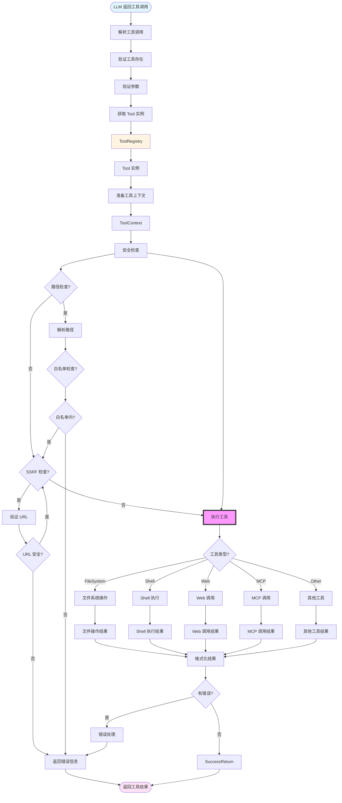

# 工具调用与执行流程

```mermaid
flowchart TD
    Start([LLM 返回工具调用]) --> ParseTool[解析工具调用]
    ParseTool --> ValidateTool[验证工具存在]
    ValidateTool --> ValidateParams[验证参数]

    ValidateParams --> GetTool[获取 Tool 实例]
    GetTool --> ToolRegistry[ToolRegistry]

    ToolRegistry --> ToolInstance[Tool 实例]
    ToolInstance --> PrepareContext[准备工具上下文]
    PrepareContext --> ToolContext[ToolContext]

    ToolContext --> CheckSafety[安全检查]
    CheckSafety --> ValidatePath{路径检查?}
    ValidatePath -->|是| ResolvePath[解析路径]
    ResolvePath --> CheckWhitelist{白名单检查?}
    ValidatePath -->|否| CheckSSRF

    CheckSSRF{SSRF 检查?}
    CheckSSRF -->|是| CheckURL[验证 URL]
    CheckSSRF -->|否| ExecuteTool

    CheckURL --> URLSafe{URL 安全?}
    URLSafe -->|否| ErrorReturn[返回安全错误]
    URLSafe -->|是| CheckSSRF

    CheckWhitelist --> WhitelistOK{白名单内?}
    WhitelistOK -->|否| ErrorReturn
    WhitelistOK -->|是| CheckSSRF

    CheckSafety --> ExecuteTool[执行工具]

    ExecuteTool --> ToolType{工具类型?}

    ToolType -->|FileSystem| FSOperation[文件系统操作]
    ToolType -->|Shell| ShellExec[Shell 执行]
    ToolType -->|Web| WebCall[Web 调用]
    ToolType -->|MCP| MCPInvoke[MCP 调用]
    ToolType -->|Other| OtherTool[其他工具]

    FSOperation --> FileResult[文件操作结果]
    ShellExec --> ShellResult[Shell 执行结果]
    WebCall --> WebResult[Web 调用结果]
    MCPInvoke --> MCPResult[MCP 调用结果]
    OtherTool --> OtherResult[其他工具结果]

    FileResult --> FormatResult[格式化结果]
    ShellResult --> FormatResult
    WebResult --> FormatResult
    MCPResult --> FormatResult
    OtherResult --> FormatResult

    FormatResult --> CheckError{有错误?}
    CheckError -->|是| ErrorHandler[错误处理]
    CheckError -->|否| SuccessReturn

    ErrorHandler --> ErrorReturn[返回错误信息]
    ErrorReturn --> End([返回工具结果])

    SuccessReturn --> End

    style Start fill:#e1f5ff
    style End fill:#ffe1f5
    style ToolRegistry fill:#fff4e1
    style ExecuteTool fill:#f9f,stroke:#333,stroke-width:4px
```