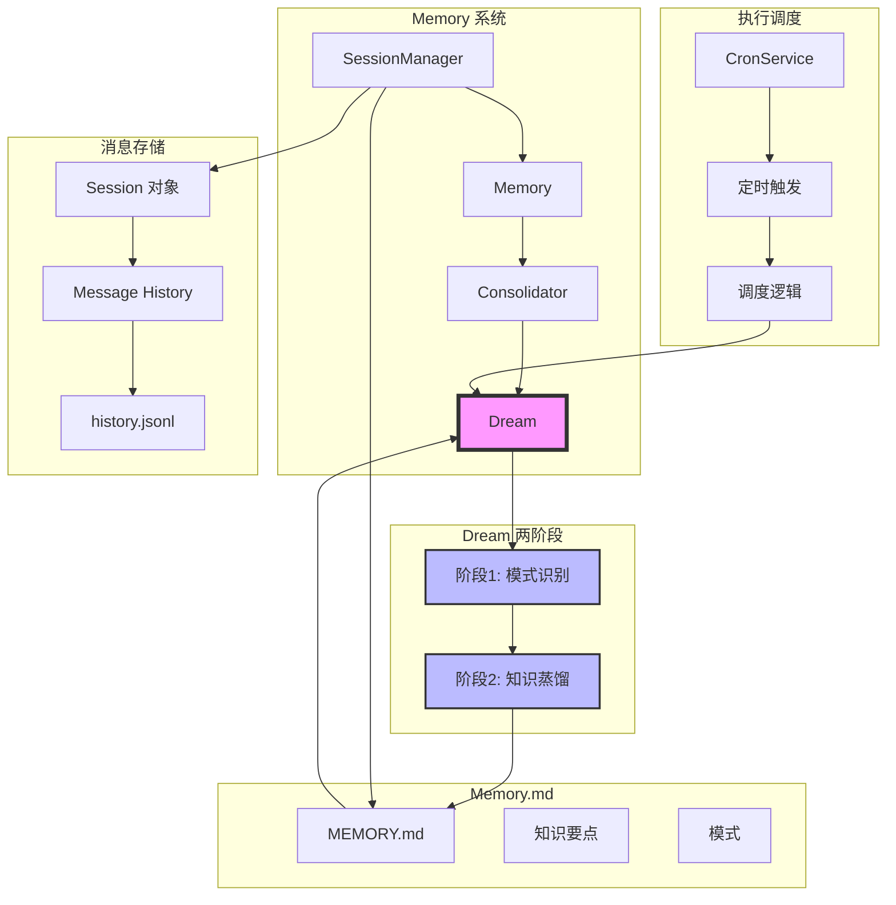
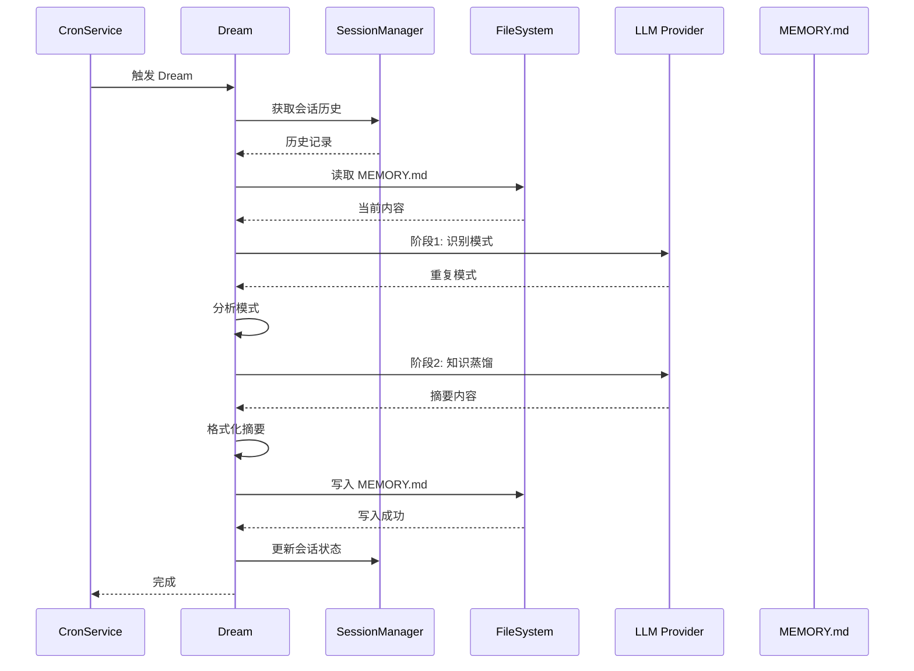
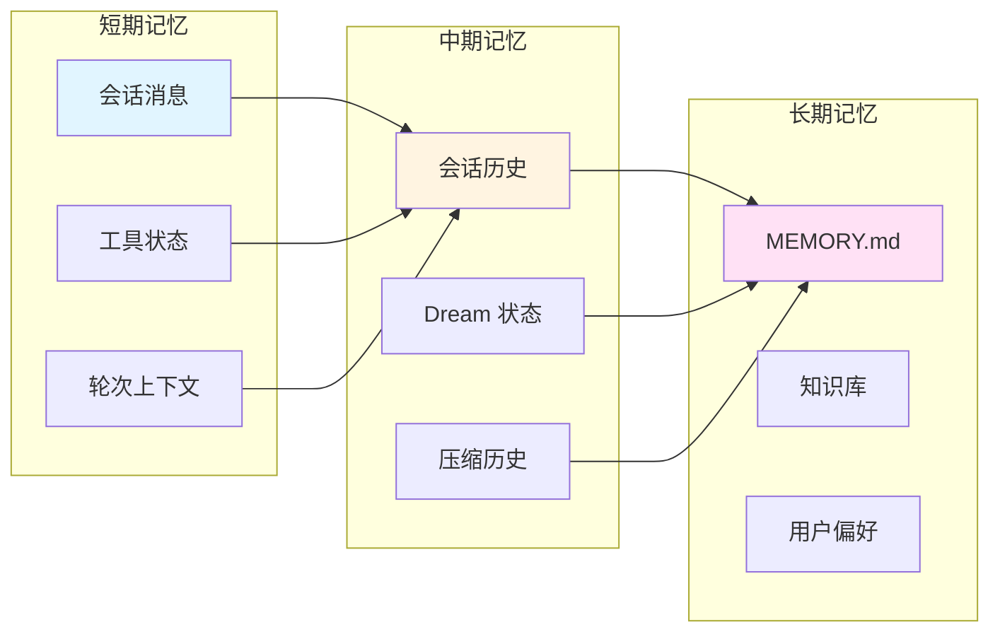

# Memory 系统架构图

```mermaid
graph TB
    subgraph "Memory 系统"
        SM[SessionManager]
        MEM[Memory]
        CON[Consolidator]
        DH[Dream]
    end

    subgraph "消息存储"
        MH[Message History]
        SJ[history.jsonl]
        ST[Session 对象]
    end

    subgraph "Dream 两阶段"
        P1[阶段1: 模式识别]
        P2[阶段2: 知识蒸馏]
    end

    subgraph "Memory.md"
        MM[MEMORY.md]
        KP[知识要点]
        PM[模式]
    end

    subgraph "执行调度"
        CR[CronService]
        TI[定时触发]
        SC[调度逻辑]
    end

    SM --> ST
    ST --> MH
    MH --> SJ

    SM --> MEM
    MEM --> CON
    CON --> DH

    DH --> P1
    P1 --> P2
    P2 --> MM

    CR --> TI
    TI --> SC
    SC --> DH

    MM --> DH
    SM --> MM

    style DH fill:#f9f,stroke:#333,stroke-width:4px
    style P1 fill:#bbf,stroke:#333,stroke-width:2px
    style P2 fill:#bbf,stroke:#333,stroke-width:2px
```

## Dream 执行流程

```mermaid
sequenceDiagram
    participant CR as CronService
    participant DH as Dream
    participant SM as SessionManager
    participant FS as FileSystem
    participant LLM as LLM Provider
    participant MM as MEMORY.md

    CR->>DH: 触发 Dream
    DH->>SM: 获取会话历史
    SM-->>DH: 历史记录

    DH->>FS: 读取 MEMORY.md
    FS-->>DH: 当前内容

    DH->>LLM: 阶段1: 识别模式
    LLM-->>DH: 重复模式
    DH->>DH: 分析模式

    DH->>LLM: 阶段2: 知识蒸馏
    LLM-->>DH: 摘要内容
    DH->>DH: 格式化摘要

    DH->>FS: 写入 MEMORY.md
    FS-->>DH: 写入成功

    DH->>SM: 更新会话状态
    DH-->>CR: 完成
```

## 记忆存储层次

```mermaid
graph LR
    subgraph "短期记忆"
        S1[会话消息]
        S2[工具状态]
        S3[轮次上下文]
    end

    subgraph "中期记忆"
        M1[会话历史]
        M2[Dream 状态]
        M3[压缩历史]
    end

    subgraph "长期记忆"
        L1[MEMORY.md]
        L2[知识库]
        L3[用户偏好]
    end

    S1 --> M1
    S2 --> M1
    S3 --> M1

    M1 --> L1
    M2 --> L1
    M3 --> L1

    style S1 fill:#e1f5ff
    style M1 fill:#fff4e1
    style L1 fill:#ffe1f5
```