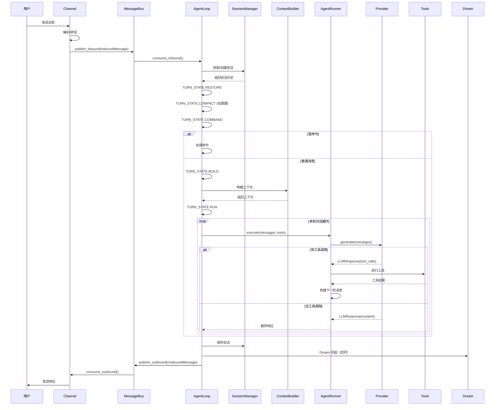

# 消息流转架构图

```mermaid
sequenceDiagram
    participant U as 用户
    participant C as Channel
    participant MB as MessageBus
    participant AL as AgentLoop
    participant SE as SessionManager
    participant CT as ContextBuilder
    participant AR as AgentRunner
    participant PR as Provider
    participant TR as Tools
    participant DH as Dream

    U->>C: 发送消息
    C->>C: 解析/转写
    C->>MB: publish_inbound(InboundMessage)

    MB->>AL: consume_inbound()
    AL->>SE: 获取/创建会话
    SE-->>AL: 返回会话历史

    AL->>AL: TURN_STATE.RESTORE
    AL->>AL: TURN_STATE.COMPACT (如需要)

    AL->>AL: TURN_STATE.COMMAND
    alt 是命令
        AL->>AL: 处理命令
    else 普通消息
        AL->>AL: TURN_STATE.BUILD
        AL->>CT: 构建上下文
        CT-->>AL: 返回上下文

        AL->>AL: TURN_STATE.RUN

        loop 多轮对话循环
            AL->>AR: execute(messages, tools)
            AR->>PR: generate(messages)

            alt 有工具调用
                PR-->>AR: LLMResponse(tool_calls)
                AR->>TR: 执行工具
                TR-->>AR: 工具结果
                AR->>AR: 构建下一轮消息
            else 无工具调用
                PR-->>AR: LLMResponse(content)
                AR-->>AL: 最终响应
            end
        end
    end

    AL->>SE: 保存会话
    AL->>DH: Dream 巩固（定时）
    AL->>MB: publish_outbound(OutboundMessage)

    MB->>C: consume_outbound()
    C->>U: 发送响应
```