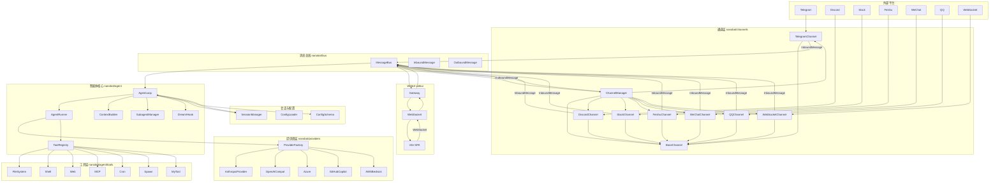

# 项目整体架构图

```mermaid
graph TB
    subgraph "外部平台"
        T[Telegram]
        D[Discord]
        S[Slack]
        F[Feishu]
        WX[WeChat]
        QQ[QQ]
        WS[WebSocket]
    end

    subgraph "通道层 nanobot/channels"
        CM[ChannelManager]
        T1[TelegramChannel]
        D1[DiscordChannel]
        S1[SlackChannel]
        F1[FeishuChannel]
        WX1[WeChatChannel]
        QQ1[QQChannel]
        WS1[WebSocketChannel]
        B[BaseChannel]
    end

    subgraph "消息总线 nanobot/bus"
        MB[MessageBus]
        IM[InboundMessage]
        OM[OutboundMessage]
    end

    subgraph "智能体核心 nanobot/agent"
        AL[AgentLoop]
        AR[AgentRunner]
        CT[ContextBuilder]
        TR[ToolRegistry]
        SM[SubagentManager]
        DH[Dream/Hook]
    end

    subgraph "工具层 nanobot/agent/tools"
        FS[FileSystem]
        SH[Shell]
        WB[Web]
        MC[MCP]
        CR[Cron]
        SP[Spawn]
        MY[MyTool]
    end

    subgraph "提供商层 nanobot/providers"
        PR[ProviderFactory]
        AP[AnthropicProvider]
        OP[OpenAICompat]
        AZ[Azure]
        GH[GitHubCopilot]
        BW[AWSBedrock]
    end

    subgraph "会话与配置"
        SE[SessionManager]
        CF[ConfigLoader]
        CS[ConfigSchema]
    end

    subgraph "WebUI webui"
        VA[Vite SPA]
        GW[Gateway]
        WS2[WebSocket]
    end

    T --> T1
    D --> D1
    S --> S1
    F --> F1
    WX --> WX1
    QQ --> QQ1
    WS --> WS1

    T1 --> B
    D1 --> B
    S1 --> B
    F1 --> B
    WX1 --> B
    QQ1 --> B
    WS1 --> B

    CM --> B
    CM --> MB

    T1 -->|InboundMessage| MB
    D1 -->|InboundMessage| MB
    S1 -->|InboundMessage| MB
    F1 -->|InboundMessage| MB
    WX1 -->|InboundMessage| MB
    QQ1 -->|InboundMessage| MB
    WS1 -->|InboundMessage| MB

    MB --> AL
    AL --> AR
    AL --> CT
    AR --> PR

    PR --> AP
    PR --> OP
    PR --> AZ
    PR --> GH
    PR --> BW

    AR --> TR
    TR --> FS
    TR --> SH
    TR --> WB
    TR --> MC
    TR --> CR
    TR --> SP
    TR --> MY

    AL --> SM
    AL --> DH
    AL --> SE

    VA -->|WebSocket| WS2
    WS2 --> GW
    GW --> MB
    MB --> GW
    GW --> WS2
    WS2 --> VA

    MB -->|OutboundMessage| CM
    CM --> T1
    CM --> D1
    CM --> S1
    CM --> F1
    CM --> WX1
    CM --> QQ1
    CM --> WS1

    SE <--> AL
    AL --> CS
```