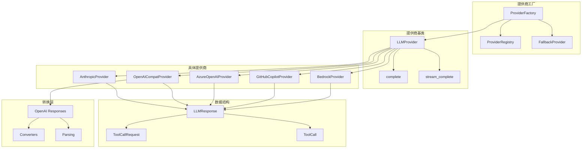
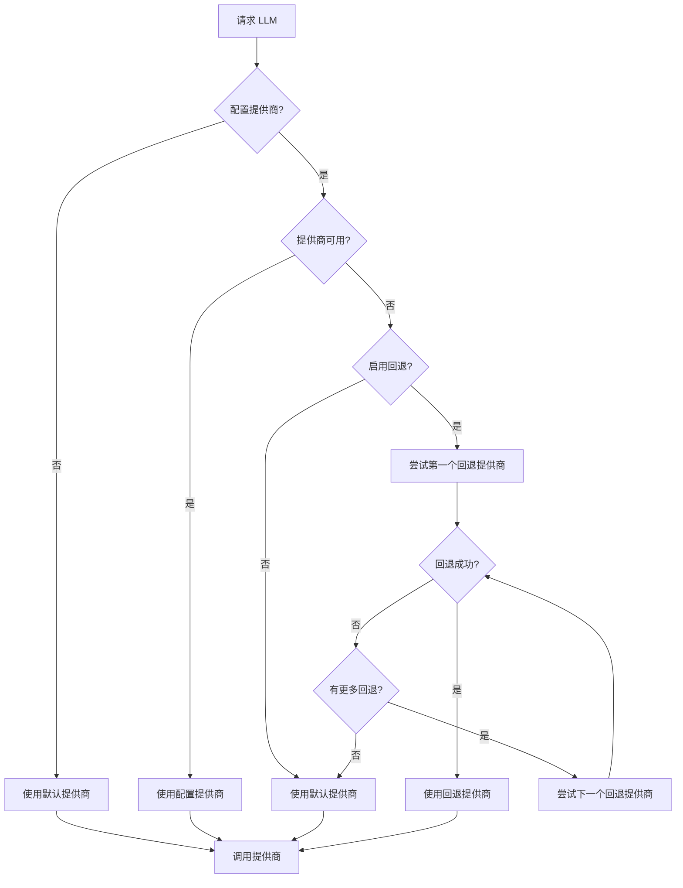

# 提供商抽象架构图

```mermaid
graph TB
    subgraph "提供商工厂"
        PF[ProviderFactory]
        PR[ProviderRegistry]
        FB[FallbackProvider]
    end

    subgraph "提供商基类"
        LP[LLMProvider]
        LC[complete]
        LSC[stream_complete]
    end

    subgraph "具体提供商"
        AP[AnthropicProvider]
        OP[OpenAICompatProvider]
        AZP[AzureOpenAIProvider]
        GHP[GitHubCopilotProvider]
        BP[BedrockProvider]
    end

    subgraph "数据结构"
        TCR[ToolCallRequest]
        LR[LLMResponse]
        TC[ToolCall]
    end

    subgraph "转换层"
        OC[OpenAI Responses]
        CV[Converters]
        PP[Parsing]
    end

    PF --> PR
    PF --> LP
    PF --> FB

    LP --> AP
    LP --> OP
    LP --> AZP
    LP --> GHP
    LP --> BP

    LP --> LC
    LP --> LSC

    AP --> LR
    OP --> LR
    AZP --> LR
    GHP --> LR
    BP --> LR

    LR --> TCR
    LR --> TC

    OP --> OC
    OC --> CV
    OC --> PP
```

## 提供商选择流程

```mermaid
flowchart TD
    A[请求 LLM] --> B{配置提供商?}
    B -->|是| C{提供商可用?}
    B -->|否| D[使用默认提供商]

    C -->|是| E[使用配置提供商]
    C -->|否| F{启用回退?}

    F -->|是| G[尝试第一个回退提供商]
    F -->|否| H[使用默认提供商]

    G --> I{回退成功?}
    I -->|是| J[使用回退提供商]
    I -->|否| K{有更多回退?}

    K -->|是| L[尝试下一个回退提供商]
    K -->|否| H

    L --> I
    D --> M[调用提供商]
    E --> M
    H --> M
    J --> M
```