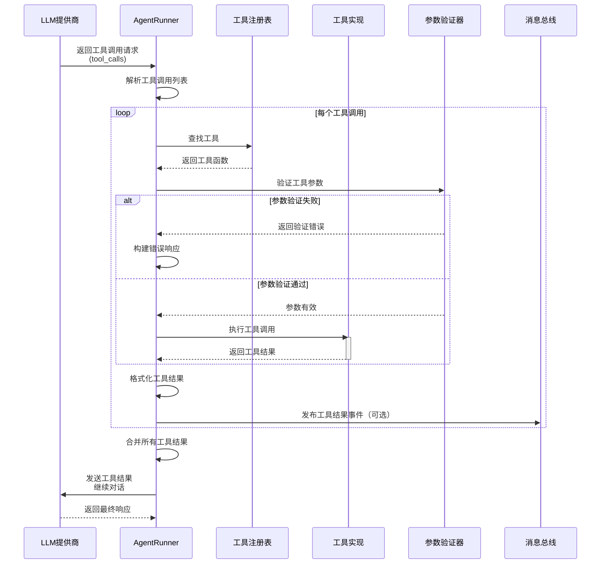

# 工具调用时序图

```mermaid
sequenceDiagram
    participant LLM as LLM提供商
    participant Runner as AgentRunner
    participant Registry as 工具注册表
    participant Tool as 工具实现
    participant Validator as 参数验证器
    participant Bus as 消息总线

    LLM->>Runner: 返回工具调用请求<br/>(tool_calls)
    Runner->>Runner: 解析工具调用列表

    loop 每个工具调用
        Runner->>Registry: 查找工具
        Registry-->>Runner: 返回工具函数

        Runner->>Validator: 验证工具参数
        alt 参数验证失败
            Validator-->>Runner: 返回验证错误
            Runner->>Runner: 构建错误响应
        else 参数验证通过
            Validator-->>Runner: 参数有效
            Runner->>Tool: 执行工具调用
            activate Tool
            Tool-->>Runner: 返回工具结果
            deactivate Tool
        end

        Runner->>Runner: 格式化工具结果
        Runner->>Bus: 发布工具结果事件（可选）
    end

    Runner->>Runner: 合并所有工具结果
    Runner->>LLM: 发送工具结果<br/>继续对话
    LLM-->>Runner: 返回最终响应
```