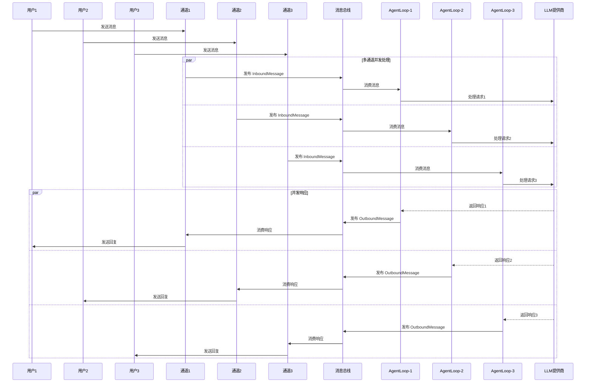

# 多通道并发时序图

```mermaid
sequenceDiagram
    participant User1 as 用户1
    participant User2 as 用户2
    participant User3 as 用户3
    participant Channel1 as 通道1
    participant Channel2 as 通道2
    participant Channel3 as 通道3
    participant Bus as 消息总线
    participant Loop1 as AgentLoop-1
    participant Loop2 as AgentLoop-2
    participant Loop3 as AgentLoop-3
    participant LLM as LLM提供商

    User1->>Channel1: 发送消息
    User2->>Channel2: 发送消息
    User3->>Channel3: 发送消息

    par 多通道并发处理
        Channel1->>Bus: 发布 InboundMessage
        Bus->>Loop1: 消费消息
        Loop1->>LLM: 处理请求1
    and
        Channel2->>Bus: 发布 InboundMessage
        Bus->>Loop2: 消费消息
        Loop2->>LLM: 处理请求2
    and
        Channel3->>Bus: 发布 InboundMessage
        Bus->>Loop3: 消费消息
        Loop3->>LLM: 处理请求3
    end

    par 并发响应
        LLM-->>Loop1: 返回响应1
        Loop1->>Bus: 发布 OutboundMessage
        Bus->>Channel1: 消费响应
        Channel1->>User1: 发送回复
    and
        LLM-->>Loop2: 返回响应2
        Loop2->>Bus: 发布 OutboundMessage
        Bus->>Channel2: 消费响应
        Channel2->>User2: 发送回复
    and
        LLM-->>Loop3: 返回响应3
        Loop3->>Bus: 发布 OutboundMessage
        Bus->>Channel3: 消费响应
        Channel3->>User3: 发送回复
    end
```