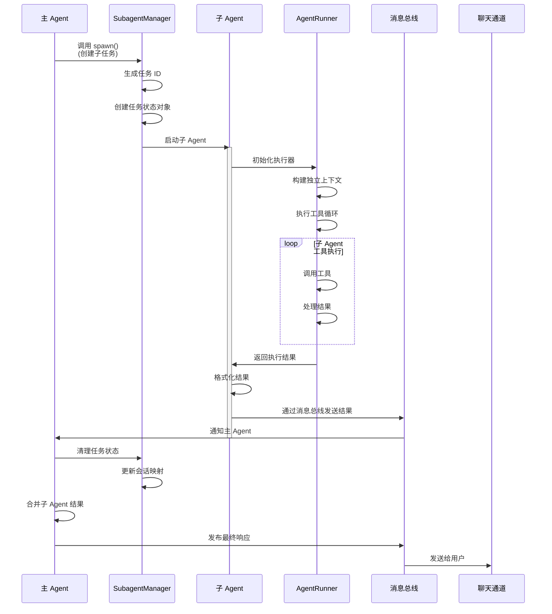

# 子 Agent 调用时序图

```mermaid
sequenceDiagram
    participant MainAgent as 主 Agent
    participant SubagentMgr as SubagentManager
    participant SubAgent as 子 Agent
    participant Runner as AgentRunner
    participant Bus as 消息总线
    participant Channel as 聊天通道

    MainAgent->>SubagentMgr: 调用 spawn()<br/>(创建子任务)
    SubagentMgr->>SubagentMgr: 生成任务 ID
    SubagentMgr->>SubagentMgr: 创建任务状态对象

    SubagentMgr->>SubAgent: 启动子 Agent
    activate SubAgent

    SubAgent->>Runner: 初始化执行器
    Runner->>Runner: 构建独立上下文
    Runner->>Runner: 执行工具循环

    loop 子 Agent 工具执行
        Runner->>Runner: 调用工具
        Runner->>Runner: 处理结果
    end

    Runner->>SubAgent: 返回执行结果
    SubAgent->>SubAgent: 格式化结果

    SubAgent->>Bus: 通过消息总线发送结果
    Bus->>MainAgent: 通知主 Agent
    deactivate SubAgent

    MainAgent->>SubagentMgr: 清理任务状态
    SubagentMgr->>SubagentMgr: 更新会话映射

    MainAgent->>MainAgent: 合并子 Agent 结果
    MainAgent->>Bus: 发布最终响应
    Bus->>Channel: 发送给用户
```