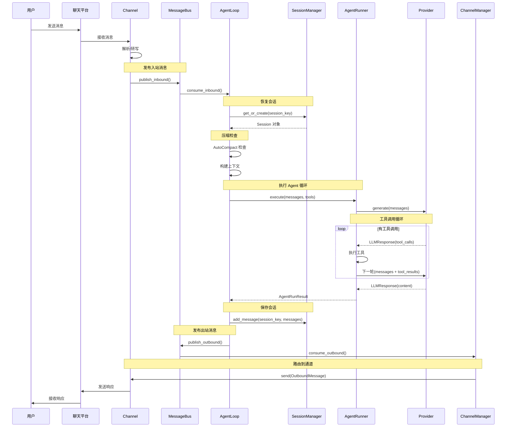

# 用户消息处理时序图

```mermaid
sequenceDiagram
    participant U as 用户
    participant P as 聊天平台
    participant C as Channel
    participant MB as MessageBus
    participant AL as AgentLoop
    participant SE as SessionManager
    participant AR as AgentRunner
    participant PR as Provider
    participant CM as ChannelManager

    U->>P: 发送消息
    P->>C: 接收消息
    C->>C: 解析/转写

    Note over C,MB: 发布入站消息
    C->>MB: publish_inbound()
    MB->>AL: consume_inbound()

    Note over AL,SE: 恢复会话
    AL->>SE: get_or_create(session_key)
    SE-->>AL: Session 对象

    Note over AL,AL: 压缩检查
    AL->>AL: AutoCompact 检查
    AL->>AL: 构建上下文

    Note over AL,AR: 执行 Agent 循环
    AL->>AR: execute(messages, tools)
    AR->>PR: generate(messages)

    Note over PR,AR: 工具调用循环
    loop 有工具调用
        PR-->>AR: LLMResponse(tool_calls)
        AR->>AR: 执行工具
        AR->>PR: 下一轮(messages + tool_results)
    end

    PR-->>AR: LLMResponse(content)
    AR-->>AL: AgentRunResult

    Note over AL,SE: 保存会话
    AL->>SE: add_message(session_key, messages)

    Note over AL,MB: 发布出站消息
    AL->>MB: publish_outbound()
    MB->>CM: consume_outbound()

    Note over CM,C: 路由到通道
    CM->>C: send(OutboundMessage)
    C->>P: 发送响应
    P->>U: 接收响应
```