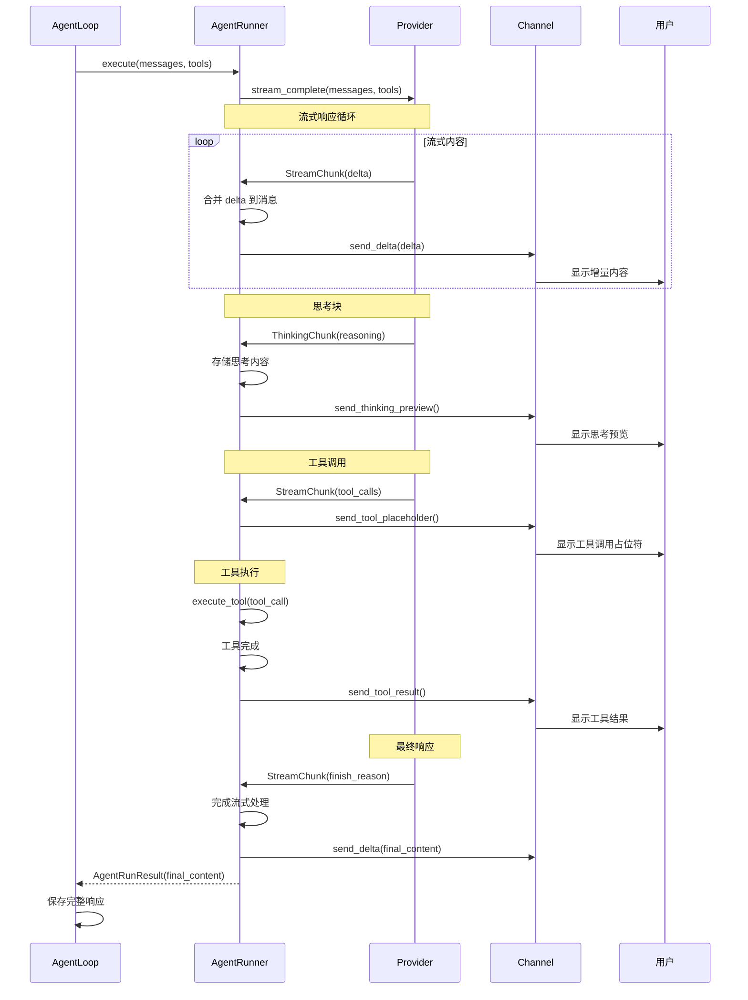

# 流式响应时序图

```mermaid
sequenceDiagram
    participant AL as AgentLoop
    participant AR as AgentRunner
    participant PR as Provider
    participant C as Channel
    participant U as 用户

    AL->>AR: execute(messages, tools)
    AR->>PR: stream_complete(messages, tools)

    Note over PR,AR: 流式响应循环
    loop 流式内容
        PR->>AR: StreamChunk(delta)
        AR->>AR: 合并 delta 到消息
        AR->>C: send_delta(delta)
        C->>U: 显示增量内容
    end

    Note over PR,AR: 思考块
    PR->>AR: ThinkingChunk(reasoning)
    AR->>AR: 存储思考内容
    AR->>C: send_thinking_preview()
    C->>U: 显示思考预览

    Note over PR,AR: 工具调用
    PR->>AR: StreamChunk(tool_calls)
    AR->>C: send_tool_placeholder()
    C->>U: 显示工具调用占位符

    Note over AR: 工具执行
    AR->>AR: execute_tool(tool_call)
    AR->>AR: 工具完成
    AR->>C: send_tool_result()
    C->>U: 显示工具结果

    Note over PR: 最终响应
    PR->>AR: StreamChunk(finish_reason)
    AR->>AR: 完成流式处理
    AR->>C: send_delta(final_content)
    AR-->>AL: AgentRunResult(final_content)

    AL->>AL: 保存完整响应
```