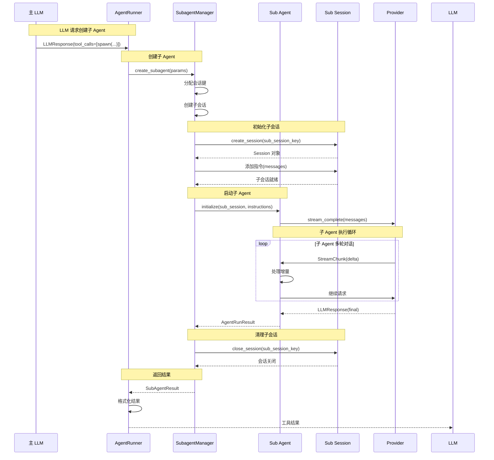

# 子 Agent 调用时序图

```mermaid
sequenceDiagram
    participant LL as 主 LLM
    participant AR as AgentRunner
    participant SM as SubagentManager
    participant SA as Sub Agent
    participant SE as Sub Session
    participant PR as Provider

    Note over LL,AR: LLM 请求创建子 Agent
    LL->>AR: LLMResponse(tool_calls=[spawn(...)])

    Note over AR,SM: 创建子 Agent
    AR->>SM: create_subagent(params)
    SM->>SM: 分配会话键
    SM->>SM: 创建子会话

    Note over SM,SE: 初始化子会话
    SM->>SE: create_session(sub_session_key)
    SE-->>SM: Session 对象
    SM->>SE: 添加指令(messages)
    SE-->>SM: 子会话就绪

    Note over SM,SA: 启动子 Agent
    SM->>SA: initialize(sub_session, instructions)
    SA->>PR: stream_complete(messages)

    Note over PR,SA: 子 Agent 执行循环
    loop 子 Agent 多轮对话
        PR->>SA: StreamChunk(delta)
        SA->>SA: 处理增量
        SA->>PR: 继续请求
    end

    PR-->>SA: LLMResponse(final)
    SA-->>SM: AgentRunResult

    Note over SM,SE: 清理子会话
    SM->>SE: close_session(sub_session_key)
    SE-->>SM: 会话关闭

    Note over SM,AR: 返回结果
    SM-->>AR: SubAgentResult
    AR->>AR: 格式化结果
    AR-->>LLM: 工具结果
```