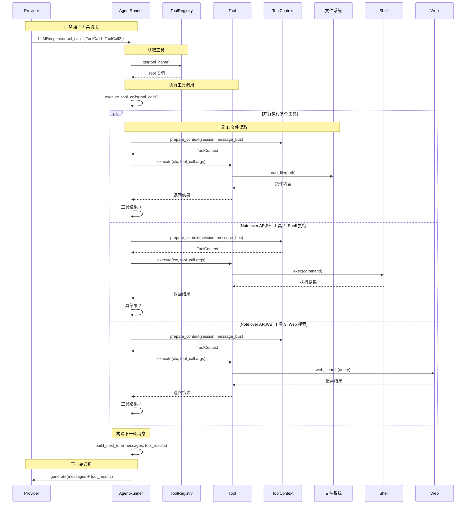

# 工具调用时序图

```mermaid
sequenceDiagram
    participant PR as Provider
    participant AR as AgentRunner
    participant TR as ToolRegistry
    participant T as Tool
    participant TC as ToolContext
    participant FS as 文件系统
    participant SH as Shell
    participant WB as Web

    Note over PR,AR: LLM 返回工具调用
    PR->>AR: LLMResponse(tool_calls=[ToolCall1, ToolCall2])

    Note over AR,TR: 获取工具
    AR->>TR: get(tool_name)
    TR-->>AR: Tool 实例

    Note over AR,T: 执行工具调用
    AR->>AR: execute_tool_calls(tool_calls)

    par 并行执行多个工具
        Note over AR,FS: 工具 1: 文件读取
        AR->>TC: prepare_context(session, message_bus)
        TC-->>AR: ToolContext
        AR->>T: execute(ctx, tool_call.args)
        T->>FS: read_file(path)
        FS-->>T: 文件内容
        T-->>AR: 返回结果
        AR->>AR: 工具结果 1

    and Note over AR,SH: 工具 2: Shell 执行
        AR->>TC: prepare_context(session, message_bus)
        TC-->>AR: ToolContext
        AR->>T: execute(ctx, tool_call.args)
        T->>SH: exec(command)
        SH-->>T: 执行结果
        T-->>AR: 返回结果
        AR->>AR: 工具结果 2

    and Note over AR,WB: 工具 3: Web 搜索
        AR->>TC: prepare_context(session, message_bus)
        TC-->>AR: ToolContext
        AR->>T: execute(ctx, tool_call.args)
        T->>WB: web_search(query)
        WB-->>T: 搜索结果
        T-->>AR: 返回结果
        AR->>AR: 工具结果 3
    end

    Note over AR,AR: 构建下一轮消息
    AR->>AR: build_next_turn(messages, tool_results)

    Note over AR,PR: 下一轮调用
    AR->>PR: generate(messages + tool_results)
```