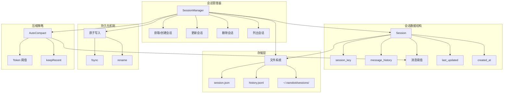
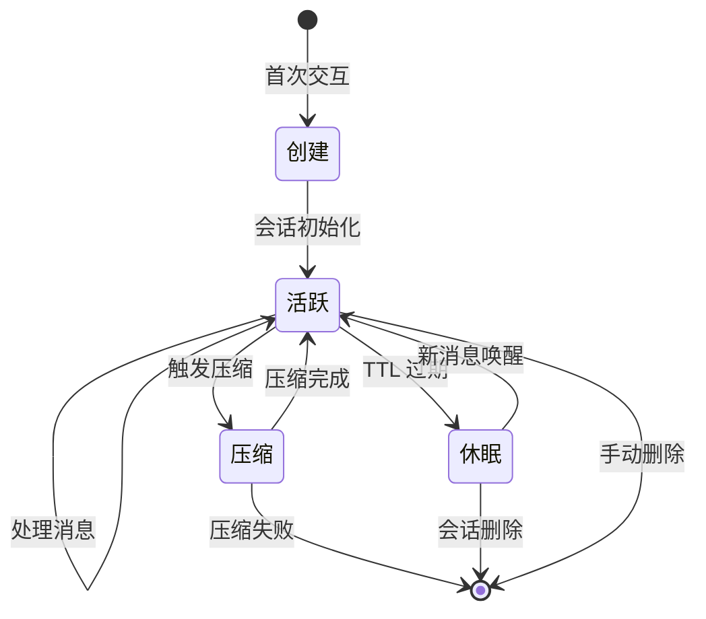
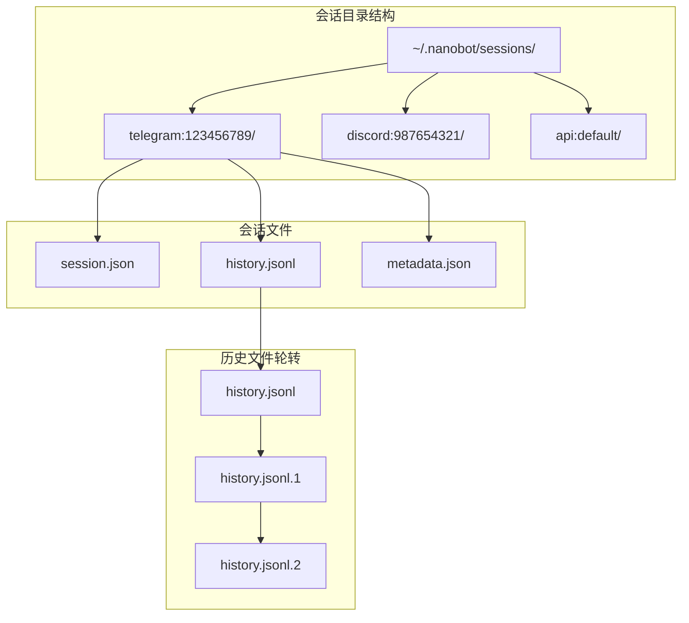

# 会话管理架构图

```mermaid
graph TB
    subgraph "会话管理器"
        SM[SessionManager]
        GC[获取/创建会话]
        US[更新会话]
        DS[删除会话]
        LS[列出会话]
    end

    subgraph "会话数据结构"
        SD[Session]
        SK[session_key]
        MH[message_history]
        MT[metadata]
        LT[last_updated]
        CC[created_at]
    end

    subgraph "存储层"
        FS[文件系统]
        SMF[session.json]
        SHF[history.jsonl]
        SDIR[~/.nanobot/sessions/]
    end

    subgraph "持久化机制"
        AW[原子写入]
        FS1[fsync]
        RN[rename]
    end

    subgraph "压缩策略"
        AC[AutoCompact]
        TT[Token 阈值]
        MT[消息阈值]
        KT[keepRecent]
    end

    SM --> SD
    SM --> GC
    SM --> US
    SM --> DS
    SM --> LS

    SD --> SK
    SD --> MH
    SD --> MT
    SD --> LT
    SD --> CC

    SM --> FS
    SD --> FS

    FS --> SDIR
    FS --> SMF
    FS --> SHF

    SM --> AW
    AW --> FS1
    AW --> RN

    SM --> AC
    AC --> TT
    AC --> MT
    AC --> KT
```

## 会话生命周期

```mermaid
stateDiagram-v2
    [*] --> 创建: 首次交互
    创建 --> 活跃: 会话初始化

    活跃 --> 活跃: 处理消息
    活跃 --> 压缩: 触发压缩
    活跃 --> 休眠: TTL 过期

    压缩 --> 活跃: 压缩完成
    压缩 -->[*]: 压缩失败

    休眠 -->[*]: 会话删除
    休眠 --> 活跃: 新消息唤醒

    活跃 -->[*]: 手动删除
```

## 会话存储格式

```mermaid
graph TB
    subgraph "会话目录结构"
        SDIR[~/.nanobot/sessions/]
        C1[telegram:123456789/]
        C2[discord:987654321/]
        C3[api:default/]
    end

    subgraph "会话文件"
        SF[session.json]
        HF[history.jsonl]
        MF[metadata.json]
    end

    subgraph "历史文件轮转"
        HF1[history.jsonl]
        HF2[history.jsonl.1]
        HF3[history.jsonl.2]
    end

    SDIR --> C1
    SDIR --> C2
    SDIR --> C3

    C1 --> SF
    C1 --> HF
    C1 --> MF

    HF --> HF1
    HF1 --> HF2
    HF2 --> HF3
```