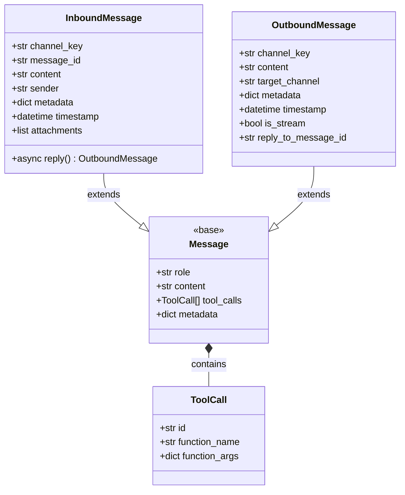

# InboundMessage/OutboundMessage 数据结构

```mermaid
classDiagram
    class InboundMessage {
        +str channel_key
        +str message_id
        +str content
        +str sender
        +dict metadata
        +datetime timestamp
        +list attachments
        +async reply() OutboundMessage
    }

    class OutboundMessage {
        +str channel_key
        +str content
        +str target_channel
        +dict metadata
        +datetime timestamp
        +bool is_stream
        +str reply_to_message_id
    }

    class Message {
        <<base>>
        +str role
        +str content
        +ToolCall[] tool_calls
        +dict metadata
    }

    class ToolCall {
        +str id
        +str function_name
        +dict function_args
    }

    InboundMessage --|> Message : extends
    OutboundMessage --|> Message : extends
    Message *-- ToolCall : contains
```