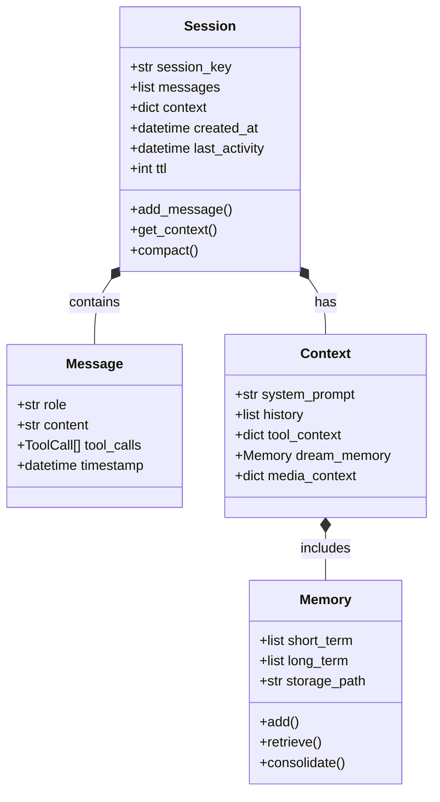

# Session 数据结构

```mermaid
classDiagram
    class Session {
        +str session_key
        +list messages
        +dict context
        +datetime created_at
        +datetime last_activity
        +int ttl
        +add_message()
        +get_context()
        +compact()
    }

    class Message {
        +str role
        +str content
        +ToolCall[] tool_calls
        +datetime timestamp
    }

    class Context {
        +str system_prompt
        +list history
        +dict tool_context
        +Memory dream_memory
        +dict media_context
    }

    class Memory {
        +list short_term
        +list long_term
        +str storage_path
        +add()
        +retrieve()
        +consolidate()
    }

    Session *-- Message : contains
    Session *-- Context : has
    Context *-- Memory : includes
```