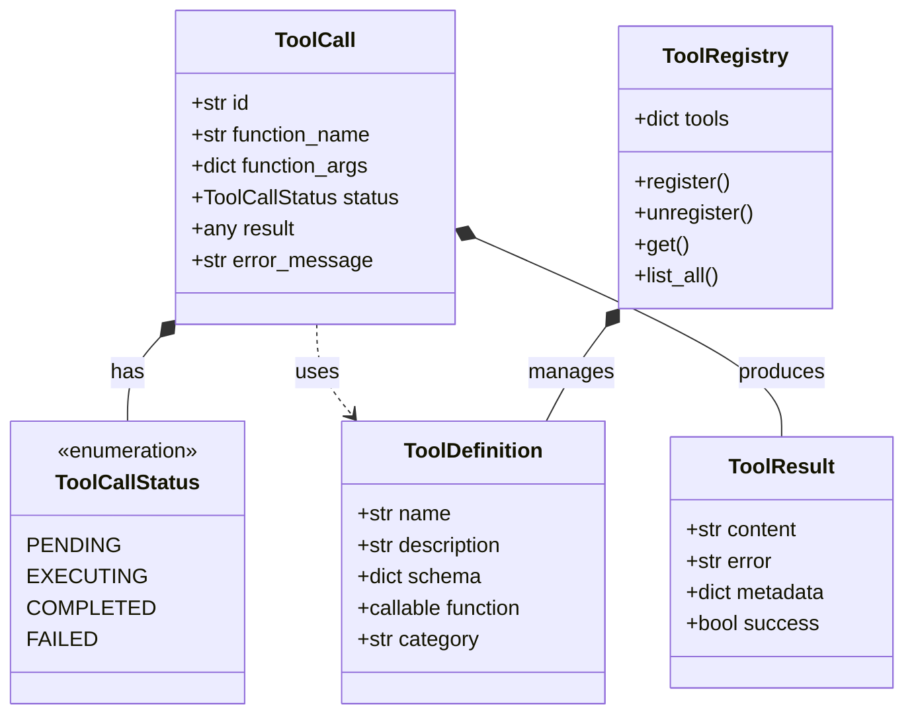

# Tool Call 数据结构

```mermaid
classDiagram
    class ToolCall {
        +str id
        +str function_name
        +dict function_args
        +ToolCallStatus status
        +any result
        +str error_message
    }

    class ToolDefinition {
        +str name
        +str description
        +dict schema
        +callable function
        +str category
    }

    class ToolResult {
        +str content
        +str error
        +dict metadata
        +bool success
    }

    class ToolRegistry {
        +dict tools
        +register()
        +unregister()
        +get()
        +list_all()
    }

    class ToolCallStatus {
        <<enumeration>>
        PENDING
        EXECUTING
        COMPLETED
        FAILED
    }

    ToolCall *-- ToolCallStatus : has
    ToolCall ..> ToolDefinition : uses
    ToolCall *-- ToolResult : produces
    ToolRegistry *-- ToolDefinition : manages
```