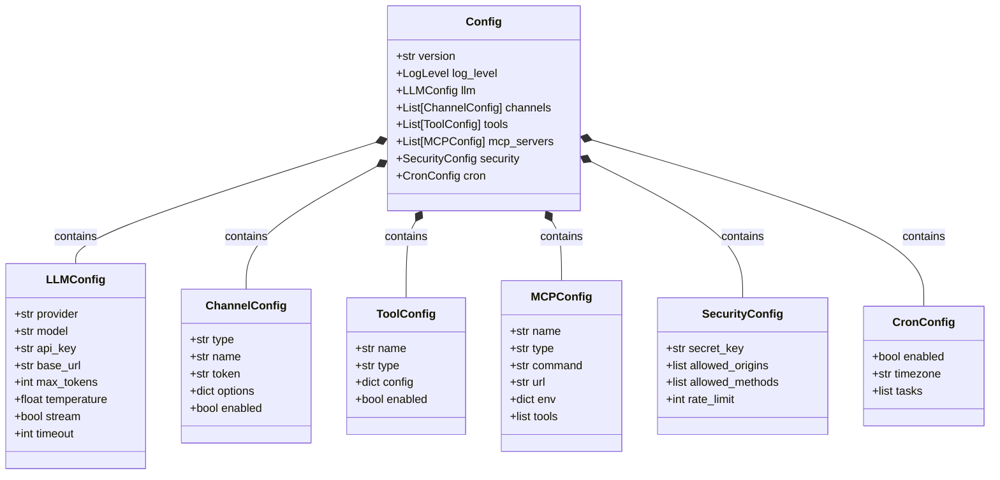

# Configuration Schema 层次结构

```mermaid
classDiagram
    class Config {
        +str version
        +LogLevel log_level
        +LLMConfig llm
        +List[ChannelConfig] channels
        +List[ToolConfig] tools
        +List[MCPConfig] mcp_servers
        +SecurityConfig security
        +CronConfig cron
    }

    class LLMConfig {
        +str provider
        +str model
        +str api_key
        +str base_url
        +int max_tokens
        +float temperature
        +bool stream
        +int timeout
    }

    class ChannelConfig {
        +str type
        +str name
        +str token
        +dict options
        +bool enabled
    }

    class ToolConfig {
        +str name
        +str type
        +dict config
        +bool enabled
    }

    class MCPConfig {
        +str name
        +str type
        +str command
        +str url
        +dict env
        +list tools
    }

    class SecurityConfig {
        +str secret_key
        +list allowed_origins
        +list allowed_methods
        +int rate_limit
    }

    class CronConfig {
        +bool enabled
        +str timezone
        +list tasks
    }

    Config *-- LLMConfig : contains
    Config *-- ChannelConfig : contains
    Config *-- ToolConfig : contains
    Config *-- MCPConfig : contains
    Config *-- SecurityConfig : contains
    Config *-- CronConfig : contains
```