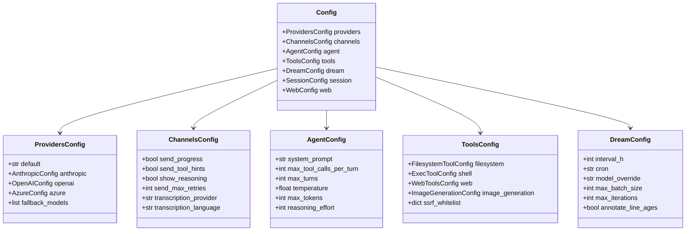

# Configuration Schema 层次



## 配置示例

### 完整配置结构

```json
{
  "providers": {
    "default": "anthropic",
    "anthropic": {
      "enabled": true,
      "apiKey": "...",
      "model": "claude-3-5-sonnet-20241022"
    },
    "fallback_models": [
      {"provider": "anthropic", "model": "claude-3-5-haiku"},
      {"provider": "openai", "model": "gpt-4"}
    ]
  },
  "channels": {
    "send_progress": true,
    "send_tool_hints": false,
    "show_reasoning": true,
    "telegram": {
      "enabled": true,
      "token": "..."
    }
  },
  "agent": {
    "system_prompt": "You are a helpful assistant.",
    "max_tool_calls_per_turn": 10,
    "max_turns": 100
  },
  "tools": {
    "filesystem": {
      "enabled": true,
      "allowed_dirs": ["~/.nanobot/workspace"]
    },
    "shell": {
      "enabled": true,
      "restrict_to_workspace": true
    }
  },
  "dream": {
    "interval_h": 2,
    "enabled": true
  }
}
```