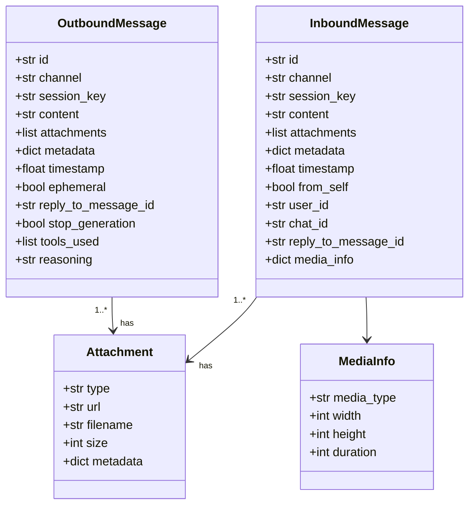

# InboundMessage/OutboundMessage 结构

## 字段说明

### InboundMessage

| 字段 | 类型 | 说明 |
|------|------|------|
| `id` | str | 消息唯一标识 |
| `channel` | str | 来源通道名称 |
| `session_key` | str | 会话键 |
| `content` | str | 消息内容 |
| `attachments` | list | 附件列表 |
| `metadata` | dict | 额外元数据 |
| `timestamp` | float | 时间戳 |
| `from_self` | bool | 是否自己发送的 |
| `user_id` | str | 用户 ID |
| `chat_id` | str | 聊天 ID |
| `reply_to_message_id` | str | 回复的消息 ID |
| `media_info` | dict | 媒体信息 |

### OutboundMessage

| 字段 | 类型 | 说明 |
|------|------|------|
| `id` | str | 消息唯一标识 |
| `channel` | str | 目标通道名称 |
| `session_key` | str | 会话键 |
| `content` | str | 响应内容 |
| `attachments` | list | 附件列表 |
| `metadata` | dict | 额外元数据 |
| `timestamp` | float | 时间戳 |
| `ephemeral` | bool | 是否临时消息 |
| `reply_to_message_id` | str | 回复的消息 ID |
| `stop_generation` | bool | 停止生成标志 |
| `tools_used` | list | 使用的工具列表 |
| `reasoning` | str | 推理内容 |