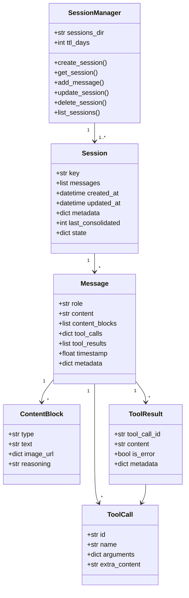

# Session 数据结构

## 字段说明

### Session

| 字段 | 类型 | 说明 |
|------|------|------|
| `key` | str | 会话唯一键 (格式: `{channel}:{chat_id}`) |
| `messages` | list | 消息历史列表 |
| `created_at` | datetime | 创建时间 |
| `updated_at` | datetime | 更新时间 |
| `metadata` | dict | 元数据 (用户信息、标签等) |
| `last_consolidated` | int | 最后巩固的消息索引 |
| `state` | dict | 运行时状态 |

### Message

| 字段 | 类型 | 说明 |
|------|------|------|
| `role` | str | 角色 (user/assistant/system) |
| `content` | str | 文本内容 |
| `content_blocks` | list | 内容块 (多模态) |
| `tool_calls` | list | 工具调用列表 |
| `tool_results` | list | 工具结果列表 |
| `timestamp` | float | 时间戳 |
| `metadata` | dict | 元数据 |

### ContentBlock

| 字段 | 类型 | 说明 |
|------|------|------|
| `type` | str | 类型 (text/image/reasoning) |
| `text` | str | 文本内容 |
| `image_url` | dict | 图片信息 |
| `reasoning` | str | 推理内容 |