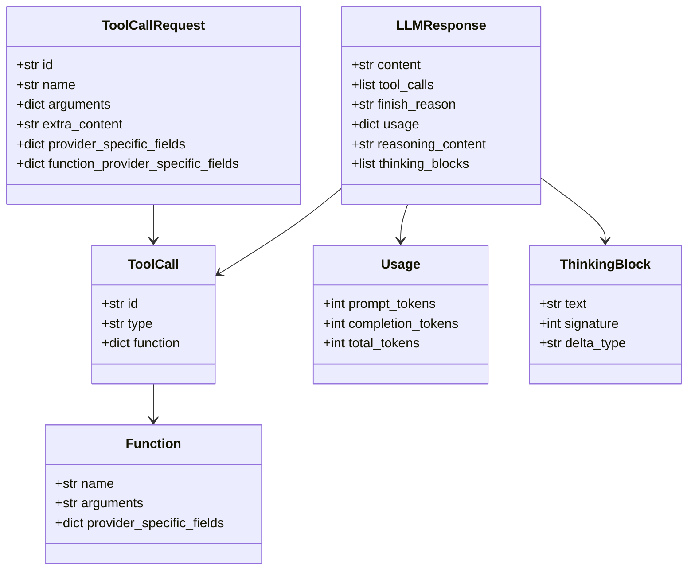

# Tool Call 结构

## 字段说明

### ToolCallRequest

| 字段 | 类型 | 说明 |
|------|------|------|
| `id` | str | 工具调用唯一 ID |
| `name` | str | 工具名称 |
| `arguments` | dict | 工具参数 |
| `extra_content` | str | 额外内容 |
| `provider_specific_fields` | dict | 提供商特定字段 |
| `function_provider_specific_fields` | dict | 函数提供商特定字段 |

### LLMResponse

| 字段 | 类型 | 说明 |
|------|------|------|
| `content` | str | 响应内容 |
| `tool_calls` | list | 工具调用列表 |
| `finish_reason` | str | 完成原因 (stop/tool_calls/error) |
| `usage` | dict | Token 使用情况 |
| `reasoning_content` | str | 推理内容 |
| `thinking_blocks` | list | 思考块列表 |