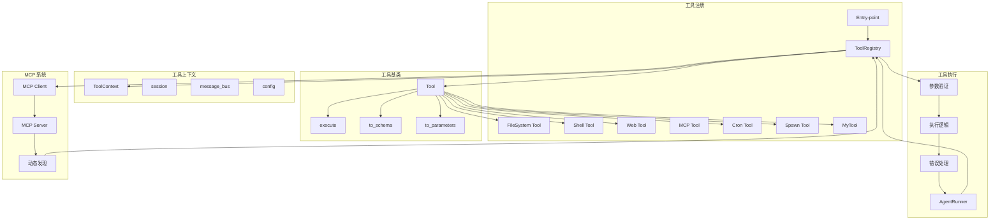
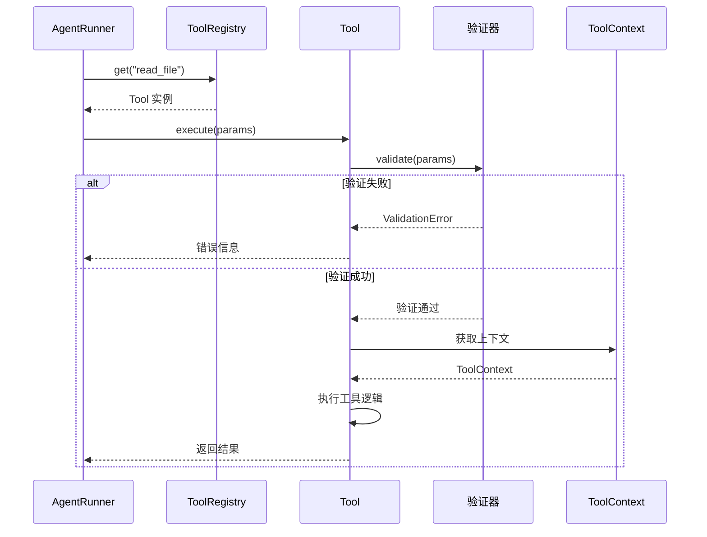

# 工具系统架构图

```mermaid
graph TB
    subgraph "工具注册"
        TR[ToolRegistry]
        FT[FileSystem Tool]
        ST[Shell Tool]
        WT[Web Tool]
        MT[MCP Tool]
        CT[Cron Tool]
        SST[Spawn Tool]
        SYT[MyTool]
        EP[Entry-point]
    end

    subgraph "工具基类"
        TB[Tool]
        TE[execute]
        TS[to_schema]
        TT[to_parameters]
    end

    subgraph "工具上下文"
        TC[ToolContext]
        TA[session]
        TMB[message_bus]
        TCF[config]
    end

    subgraph "工具执行"
        AR[AgentRunner]
        VD[参数验证]
        EE[执行逻辑]
        ER[错误处理]
    end

    subgraph "MCP 系统"
        MS[MCP Server]
        MC[MCP Client]
        MD[动态发现]
    end

    EP --> TR
    TR --> TB
    TB --> FT
    TB --> ST
    TB --> WT
    TB --> CT
    TB --> SST
    TB --> SYT

    TB --> TE
    TB --> TS
    TB --> TT

    TR --> TC

    AR --> TR
    TR --> VD
    VD --> EE
    EE --> ER
    ER --> AR

    TR --> MC
    MC --> MS
    MS --> MD
    MD --> TR
```

## 工具执行流程

```mermaid
sequenceDiagram
    participant AR as AgentRunner
    participant TR as ToolRegistry
    participant TB as Tool
    participant VD as 验证器
    participant TC as ToolContext

    AR->>TR: get("read_file")
    TR-->>AR: Tool 实例

    AR->>TB: execute(params)
    TB->>VD: validate(params)
    alt 验证失败
        VD-->>TB: ValidationError
        TB-->>AR: 错误信息
    else 验证成功
        VD-->>TB: 验证通过
        TB->>TC: 获取上下文
        TC-->>TB: ToolContext
        TB->>TB: 执行工具逻辑
        TB-->>AR: 返回结果
    end
```