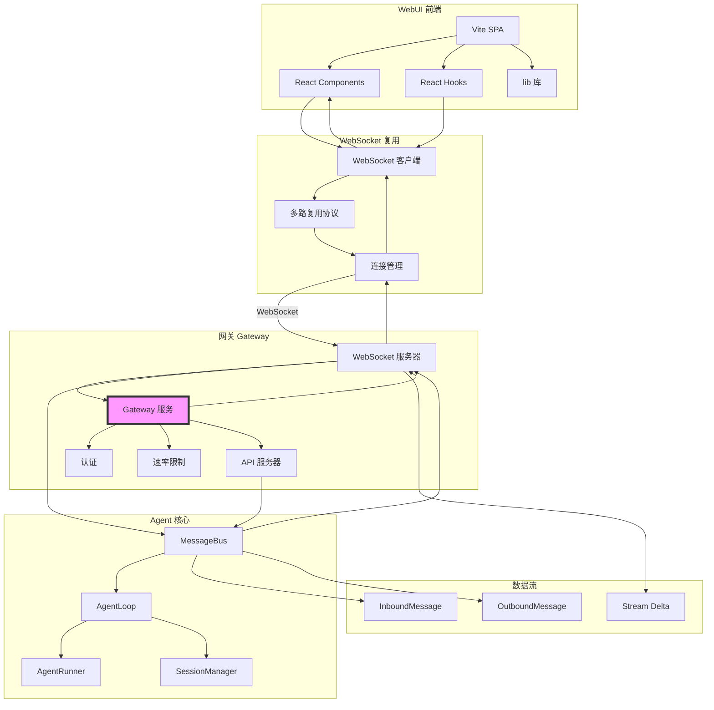
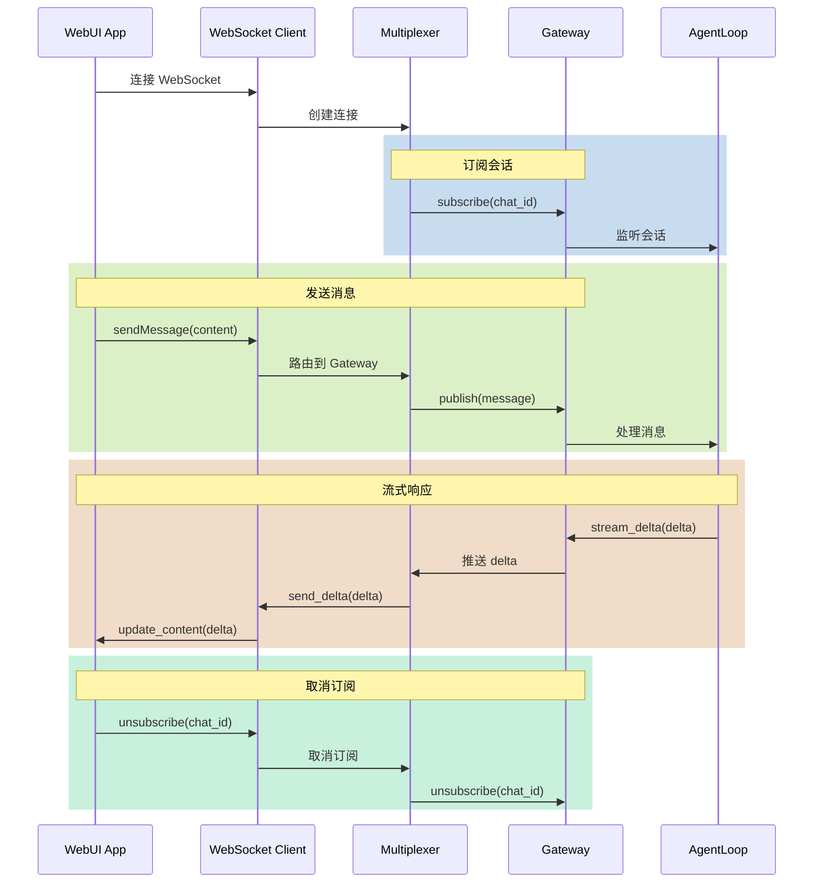
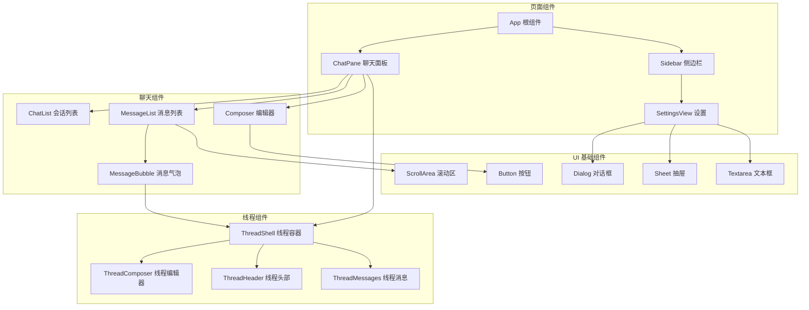

# WebUI 网关架构图

```mermaid
graph TB
    subgraph "WebUI 前端"
        VA[Vite SPA]
        CT[React Components]
        HK[React Hooks]
        LB[lib 库]
    end

    subgraph "WebSocket 复用"
        WS1[WebSocket 客户端]
        MP[多路复用协议]
        CS[连接管理]
    end

    subgraph "网关 Gateway"
        GW[Gateway 服务]
        WS2[WebSocket 服务器]
        AP[API 服务器]
        AU[认证]
        RL[速率限制]
    end

    subgraph "Agent 核心"
        MB[MessageBus]
        AL[AgentLoop]
        AR[AgentRunner]
        SE[SessionManager]
    end

    subgraph "数据流"
        IM[InboundMessage]
        OM[OutboundMessage]
        SD[Stream Delta]
    end

    VA --> CT
    VA --> HK
    VA --> LB

    CT --> WS1
    HK --> WS1

    WS1 --> MP
    MP --> CS

    CS -->|WebSocket| WS2
    WS2 --> GW

    GW --> AU
    GW --> RL
    GW --> WS2
    GW --> AP

    WS2 --> MB
    AP --> MB

    MB --> AL
    AL --> AR
    AL --> SE

    MB --> WS2
    WS2 --> CS
    CS --> WS1
    WS1 --> CT

    MB --> IM
    MB --> OM
    WS2 --> SD

    style GW fill:#f9f,stroke:#333,stroke-width:4px
```

## WebSocket 复用协议

```mermaid
sequenceDiagram
    participant WA as WebUI App
    participant WS as WebSocket Client
    participant MP as Multiplexer
    participant GW as Gateway
    participant AL as AgentLoop

    WA->>WS: 连接 WebSocket
    WS->>MP: 创建连接

    rect rgb(200, 220, 240)
    Note over MP,GW: 订阅会话
    MP->>GW: subscribe(chat_id)
    GW->>AL: 监听会话
    end

    rect rgb(220, 240, 200)
    Note over WA,GW: 发送消息
    WA->>WS: sendMessage(content)
    WS->>MP: 路由到 Gateway
    MP->>GW: publish(message)
    GW->>AL: 处理消息
    end

    rect rgb(240, 220, 200)
    Note over AL,WA: 流式响应
    AL->>GW: stream_delta(delta)
    GW->>MP: 推送 delta
    MP->>WS: send_delta(delta)
    WS->>WA: update_content(delta)
    end

    rect rgb(200, 240, 220)
    Note over WA,GW: 取消订阅
    WA->>WS: unsubscribe(chat_id)
    WS->>MP: 取消订阅
    MP->>GW: unsubscribe(chat_id)
    end
```

## WebUI 组件架构

```mermaid
graph TB
    subgraph "页面组件"
        AP[App 根组件]
        CP[ChatPane 聊天面板]
        SB[Sidebar 侧边栏]
        SV[SettingsView 设置]
    end

    subgraph "聊天组件"
        CL[ChatList 会话列表]
        ML[MessageList 消息列表]
        MB[MessageBubble 消息气泡]
        CP1[Composer 编辑器]
    end

    subgraph "线程组件"
        TS[ThreadShell 线程容器]
        TC[ThreadComposer 线程编辑器]
        TH[ThreadHeader 线程头部]
        TM[ThreadMessages 线程消息]
    end

    subgraph "UI 基础组件"
        BTN[Button 按钮]
        DLG[Dialog 对话框]
        SH[Sheet 抽屉]
        TA[Textarea 文本框]
        SA[ScrollArea 滚动区]
    end

    AP --> CP
    AP --> SB
    SB --> SV

    CP --> CL
    CP --> ML
    CP --> CP1
    CP --> TS

    ML --> MB
    MB --> TS

    TS --> TC
    TS --> TH
    TS --> TM

    CP1 --> BTN
    SV --> DLG
    SV --> SH
    SV --> TA
    ML --> SA
```